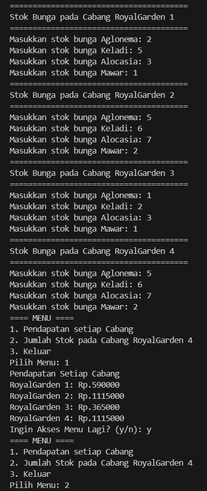
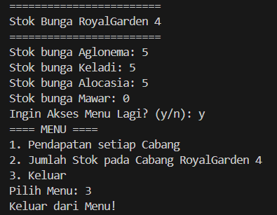

|  | Algoritma dan Struktur Data |
|--|--|
| NIM |  244107020115|
| Nama |  Bintang Pancahaya Prasetyo |
| Kelas | TI - 1H |
| Repository | [link] (https://github.com/BintangPancahaya/AlgoritmaStrukturData/tree/main/Jobsheet1) |

# JOBSHEET 1

## 2.2.1 Praktikum Pemilihan

Hasil Kode Program Pada Percobaan Pemilihan

Langkah-Langkah Kode Pemograman saya :
1. Menginput Nilai Tugas, Kuis, UTS, dan UAS
2. Jika ada nilai yang lebih dari 100, maka program akan memberi output "Nilai Tidak Valid" 
3. Jika Nilai tidak ada yang lebih dari 100, kode akan memilih Jika Nilai Huruf yang didapatkan adalah A, B+, B, C+, C maka LULUS, jika nilai huruf D dan E maka TIDAK LULUS.

## 2.3.1 Praktikum Perulangan

Hasil Kode Program Pada Percobaan Perulangan

Langkah-Langkah Kode Pemograman saya :
1. Program akan meminta user untuk menginputkan NIM
2. Dua digit diambil dan dikonversi ke int dengan menggunakan `Integer.parseInt`
3. Jika n kurang dari 10, maka n akan ditambahkan dengan 10 (n += 10)
4. Program akan mencetak n
5. Program akan melakukan perulangan dari 1 hingga n, jika (i == 6) atau (i == 10), iterasi dilewati (continue)
6. Angka genap dicetak sesuai dengan nilai dari i, sedangkan angka ganjil akan mencetak '*'

## 2.4.1 Praktikum Array

Hasil Kode Program Pada Percobaan Array

Langkah-Langkah Kode Pemograman saya :
1. Program mendeklarasikan beberapa array untuk menyimpan informasi mata kuliah :

- namaMk → Nama mata kuliah
- sks → Jumlah SKS tiap mata kuliah
- nilaiMk → Menyimpan nilai angka yang dimasukkan pengguna
- nilaiHuruf → Menyimpan nilai huruf hasil konversi dari nilai angka
- bobotSKS → Menyimpan bobot nilai berdasarkan nilai huruf

2. Program akan meminta memasukkan nilai angka untuk setiap mata kuliah dan nilai angka akan disimpan dalam array `nilaiMK`
3. Setelah menerima nilai angka, program mengonversinya menjadi 

- NIlai Huruf (A, B+, B, C+, C, D, E) berdasarkan rentang nilai
- Bobot nilai sesuai dengan standar akademik

4. Bobot nilai dikalikan dengan jumlah SKS, lalu ditambahkan ke totalNilai dan jumlah SKS juga dihitung dalam totalSKS
5. Program akan menampikan hasil konversi dalam format tabel dengan kolom

## 2.5.1 Praktikum Fungsi

Hasil Kode Program Pada Percobaan Fungsi

Langkah-Langkah Kode Pemograman saya :
1. Kode program fungsi digunakan untuk menghitung pendapatan dari penjualan bunga di beberapa cabang toko serta menampilkan stok bunga di cabang Royal Garden 4 setelah dilakukan pengurangan.
2. Program dimulai dengan mendeklarasikan array bunga yang berisi nama bunga, array harga yang menyimpan harga masing-masing bunga dari input user, serta array dua dimensi stok yang merepresentasikan jumlah stok setiap bunga di masing-masing cabang.
3. Dalam metode main, ada program menu untuk memilih fungsi mana yang mau di panggil, dan terdapat dua fungsi di luar fungsi main, yaitu Pendapatan dan StockBungaCabang4. Fungsi Pendapatan menghitung total pendapatan setiap cabang dengan mengalikan stok bunga di cabang tersebut dengan harga masing-masing bunga, lalu menjumlahkan totalnya. Hasil pendapatan untuk setiap cabang kemudian ditampilkan di terminal.
4. Fungsi StockBungaCabang4 digunakan untuk menampilkan stok bunga di Royal Garden 4 setelah dikurangi dengan jumlah tertentu sesuai dengan array pengurang, serta jika stok pada bunga itu kurang dari 0 maka program akan membuat stok bunga itu menjadi 0. Setelah pengurangan dilakukan, stok bunga yang tersisa ditampilkan ke terminal.

## Tugas 
### Tugas 1

Hasil Kode Program Pada Tugas Nomer 1

Langkah-Langkah Kode Pemograman saya :
1. Program mendeklarasikan array KODE yang berisi karakter kode plat nomor dan array KOTA yang menyimpan nama kota dalam bentuk array karakter dua dimensi.
2. Program meminta pengguna untuk memasukkan satu karakter kode plat nomor menggunakan Scanner, lalu membaca karakter pertama dari input yang diberikan. Setelah itu, Scanner ditutup untuk menghemat sumber daya.
3. Program melakukan pencarian kode plat nomor dalam array KODE menggunakan perulangan for. Jika ditemukan, program menampilkan nama kota yang sesuai dengan cara mengakses elemen array KOTA pada indeks yang sama.
4. Program mencetak karakter dalam array KOTA satu per satu untuk membentuk nama kota yang lengkap, kemudian menampilkan hasilnya di terminal. Jika kode ditemukan, pencarian dihentikan menggunakan break.
5. Jika kode yang dimasukkan tidak ada dalam array KODE, program menampilkan pesan "Kode plat tidak ditemukan", menandakan bahwa input pengguna tidak cocok dengan daftar kode yang tersedia.

### Tugas 2

Hasil Kode Program Pada Tugas Nomer 2

Langkah-Langkah Kode Pemograman saya :
1. Program menampilkan menu pilihan kepada pengguna dengan empat opsi:

- Menghitung Volume Kubus
- Menghitung Luas Permukaan Kubus
- Menghitung Keliling Kubus
- Keluar dari program

2. Pengguna diminta memasukkan angka sesuai dengan pilihan perhitungan yang diinginkan. Jika pengguna memilih opsi 4 (Keluar), program akan menampilkan pesan "Keluar dari menu!" dan keluar dari perulangan dengan break.

3. Jika pengguna memilih opsi selain 1-3, program meminta pengguna untuk memasukkan panjang rusuk kubus. Program kemudian menggunakan switch-case untuk memanggil fungsi yang sesuai dengan pilihan pengguna:

- hitungVolume(int sisi) → Mengembalikan volume kubus dengan rumus sisi³
- hitungLuasPermukaan(int sisi) → Mengembalikan luas permukaan kubus dengan rumus 6 × sisi²
- hitungKeliling(int sisi) → Mengembalikan keliling kubus dengan rumus 12 × sisi

4. Program terus menampilkan menu dan meminta input hingga pengguna memilih opsi 4. Jika pengguna memasukkan angka selain 1, 2, 3, atau 4 program akan menampilkan "Menu tidak tersedia".

### Tugas 3

Hasil Kode Program Pada Tugas Nomer 3

Langkah-Langkah Kode Pemograman saya :
1. Program meminta pengguna untuk memasukkan jumlah mata kuliah yang akan dimasukkan. Untuk setiap mata kuliah, pengguna diminta mengisi nama mata kuliah, jumlah SKS, semester, dan hari kuliah. Data ini disimpan dalam array namaMk, sks, semester, dan hari.
2. Program menampilkan menu berisi 6 pilihan:

- 1 : Input Data Mata Kuliah
- 2 : Menampilkan Seluruh Jadwal
- 3 : Menampilkan jadwal Berdasarkan Hari
- 4 : Menampilkan jadwal Berdasarkan Semester
- 5 : Mencari Mata Kuliah Berdasarkan Nama Matkul
- 6 : Keluar

    Pengguna diminta memasukkan angka sesuai dengan pilihan yang diinginkan.

3. Berdasarkan input pengguna, program memanggil salah satu dari 5 fungsi berikut:

- InputData() → Menginputkan seluruh informasi mata kuliah
- TampilJadwal() → Menampilkan seluruh daftar mata kuliah beserta informasi SKS, semester, dan hari kuliah.
- TampilJadwalHari() → Menampilkan daftar mata kuliah yang dijadwalkan pada hari tertentu.
- TampilJadwalSemester() → Menampilkan daftar mata kuliah yang tersedia pada semester tertentu.
- CariNamaMataKul() → Mencari dan menampilkan informasi mata kuliah berdasarkan nama yang dimasukkan pengguna.

4. Jika pengguna memilih untuk menampilkan jadwal berdasarkan hari, semester, atau mencari mata kuliah berdasarkan nama, program akan memeriksa apakah data yang dicari tersedia. Jika tidak ditemukan, program menampilkan pesan "Mata Kuliah Tidak Ada".

5. Program terus menampilkan menu hingga pengguna memilih opsi 6 (Keluar). Jika opsi ini dipilih, program menampilkan pesan "Keluar dari Menu." dan keluar dari perulangan menggunakan 'return'.