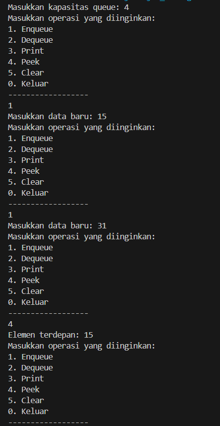
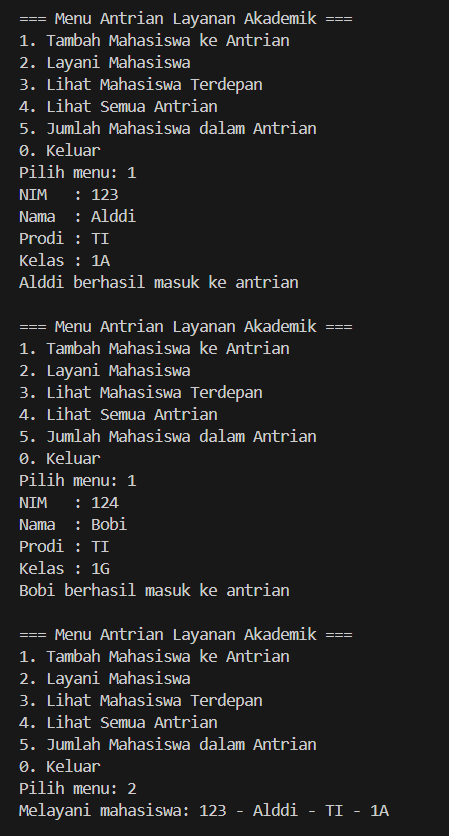
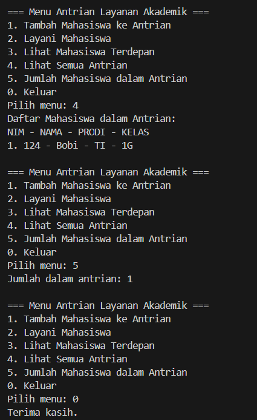
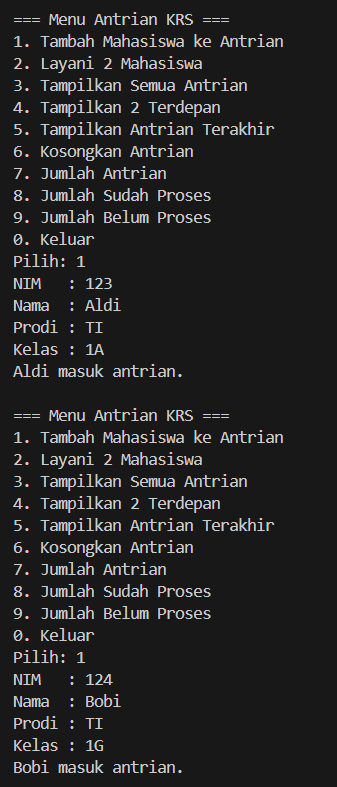
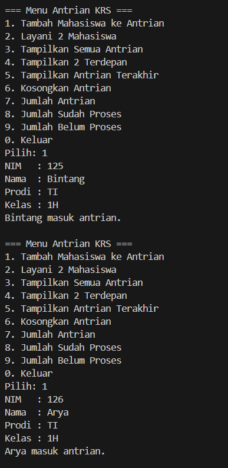
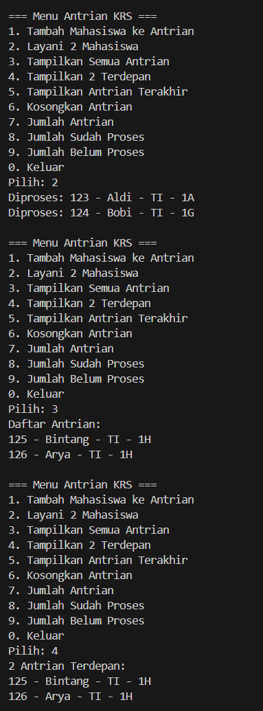
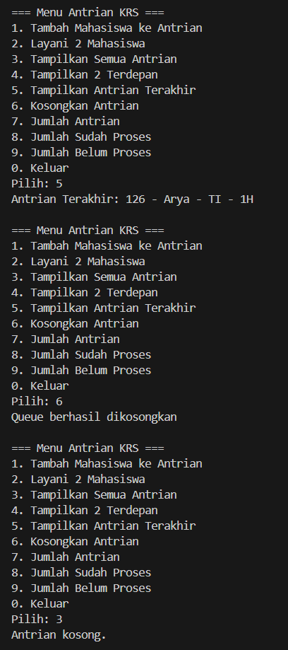
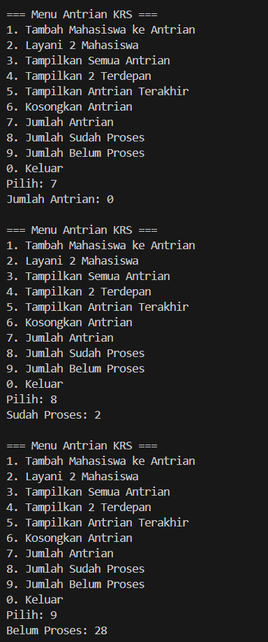
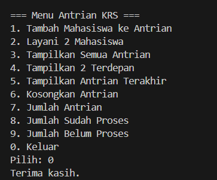

|  | Algoritma dan Struktur Data |
|--|--|
| NIM | 244107020115 |
| Nama | Bintang Pancahaya Prasetyo |
| Kelas | TI - 1H |
| Repository | [link](https://github.com/BintangPancahaya/AlgoritmaStrukturData/tree/main/Jobsheet10) |

# JOBSHEET 10

## Percobaan 1: Operasi Dasar Queue

### Hasil Kode Program



### 2.1.3 Pertanyaan

1. **Pada konstruktor, mengapa nilai awal atribut `front` dan `rear` bernilai -1, sementara atribut `size` bernilai 0?**

    - **Jawaban**  
      Karena -1 menandakan bahwa queue masih kosong dan belum ada elemen yang dimasukkan. Nilai `size` bernilai 0 karena belum ada elemen yang ditambahkan ke queue.

2. **Pada method `enqueue`, jelaskan maksud dan kegunaan dari potongan kode berikut!**

    ```java
    if (isEmpty()) {
        front = rear = 0;
    } else {
        rear = (rear + 1) % max;
    }
    ```

    - **Jawaban**  
      Potongan kode itu untuk mengatur posisi rear saat menambahkan elemen ke queue.  
      - Jika queue kosong (`isEmpty()`), maka `front` dan `rear` diset ke 0 karena elemen pertama dimasukkan.  
      - Jika tidak kosong, maka `rear` akan maju satu posisi. Penggunaan `% max` agar perputaran queue tetap dalam batas array.

3. **Pada method `dequeue`, jelaskan maksud dan kegunaan dari potongan kode berikut!**

    ```java
    if (front == max - 1) {
        front = 0;
    } else {
        front++;
    }
    ```

    - **Jawaban**  
      Potongan kode ini mengatur pergeseran posisi `front` setelah elemen dikeluarkan. Jika `front` mencapai akhir array (`max - 1`), maka `front` kembali ke awal (0).

4. **Pada method `print`, mengapa pada proses perulangan variabel `i` tidak dimulai dari 0 (`int i = 0`) melainkan `int i = front`?**

    - **Jawaban**  
      Karena data queue tidak selalu dimulai dari indeks 0, tergantung pada posisi `front`. Maka pencetakan data harus dimulai dari indeks `front`.

5. **Perhatikan kembali method `print`, jelaskan maksud dari potongan kode berikut!**

    ```java
    while (i != rear) {
        System.out.print(data[i] + " ");
        i = (i + 1) % max;
    }
    System.out.println(data[i]);
    ```

    - **Jawaban**  
      - Perulangan digunakan untuk mencetak elemen dari `front` hingga `rear`.  
      - `i = (i + 1) % max` memungkinkan perulangan indeks secara berputar.  
      - Setelah perulangan selesai, elemen pada `rear` juga ditampilkan secara terpisah.

6. **Tunjukkan potongan kode program yang merupakan queue overflow!**

    - **Jawaban**
    ```java
    if (isFull()) {
        System.out.println("Queue sudah penuh");
    }
    ```

7. **Pada saat terjadi queue overflow dan queue underflow, program tersebut tetap dapat berjalan dan hanya menampilkan teks informasi. Lakukan modifikasi program sehingga pada saat terjadi queue overflow dan queue underflow, program dihentikan!**

    - **Jawaban**
    ```java
    if (isFull()) {
        System.out.println("Queue sudah penuh");
        System.exit(0);
    }
    ```

    ```java
    if (isEmpty()) {
        System.out.println("Queue masih kosong");
        System.exit(0);
    }
    ```

## Percobaan 2: Antrian Layanan Akademik

### Hasil Kode Program




---

### 2.2.3 Pertanyaan

**Tambahkan method baru `LihatAkhir` pada class AntrianLayanan dan tambahkan daftar menu baru untuk memanggil method ini!**

- **Jawaban**  
  - Modifikasi pada class `AntrianLayanan`:
    ```java
    public void lihatAkhir() {
        if (!isEmpty()) {
            System.out.print("Mahasiswa paling akhir: ");
            data[rear].tampilkanData();
        } else {
            System.out.println("Antrian kosong.");
        }
    }
    ```

  - Tambahan pada menu `LayananAkademikSIAKAD`:
    ```java
    case 6:
        antrian.lihatAkhir();
        break;
    ```

## Langkah-langkah Program Saya

### 1. Program `Mahasiswa05.java`

**Deskripsi**:  
Merepresentasikan data mahasiswa dalam layanan akademik.

**Atribut**:
- `nim`, `nama`, `prodi`, `kelas`

**Method**:
- `tampilkanData()` – mencetak data mahasiswa ke layar

### 2. Program `AntrianKRS.java`

**Deskripsi**:  
Struktur data queue untuk mengatur antrian mahasiswa di layanan akademik.

**Method utama**:
- `tambahAntrian(Mahasiswa05 m)`
- `layaniMahasiswa05()` – memproses hingga 2 mahasiswa
- `tampilkanSemua()`, `lihatTerdepan()`, `lihatAkhir()`
- `getJumlahAntrian()`, `getMhsBelumNgurusKRS()`

### 3. Program `TugasMain.java`

**Deskripsi**:  
Program utama berbasis menu.

**Menu**:
- Tambah mahasiswa ke antrian
- Layani mahasiswa (2 sekaligus)
- Tampilkan data antrian
- Lihat terdepan dan terakhir
- Tampilkan jumlah antrian
- Keluar

**Hasil Kode Program**






