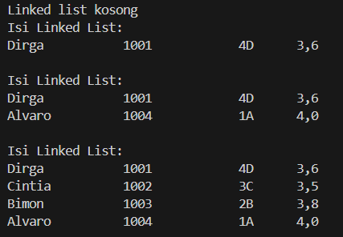
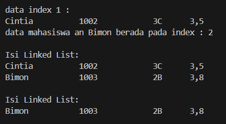
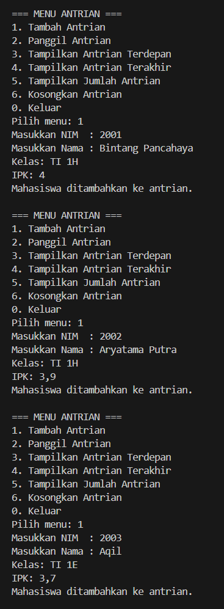
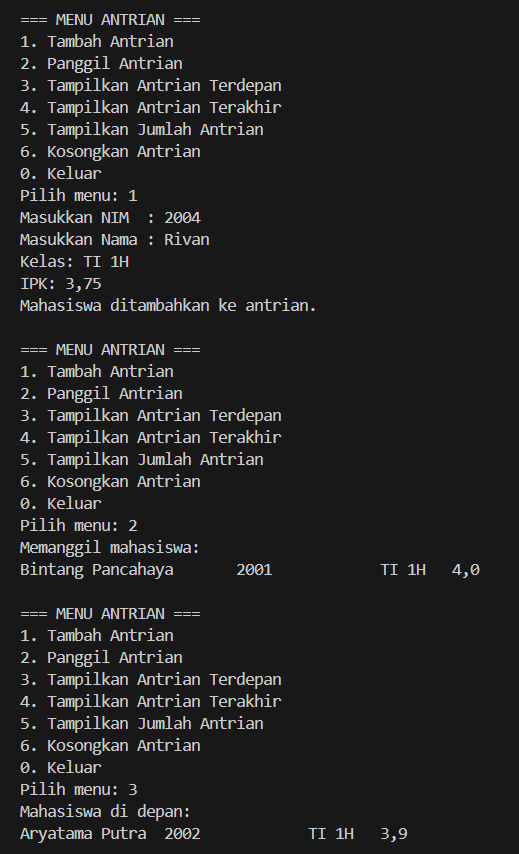
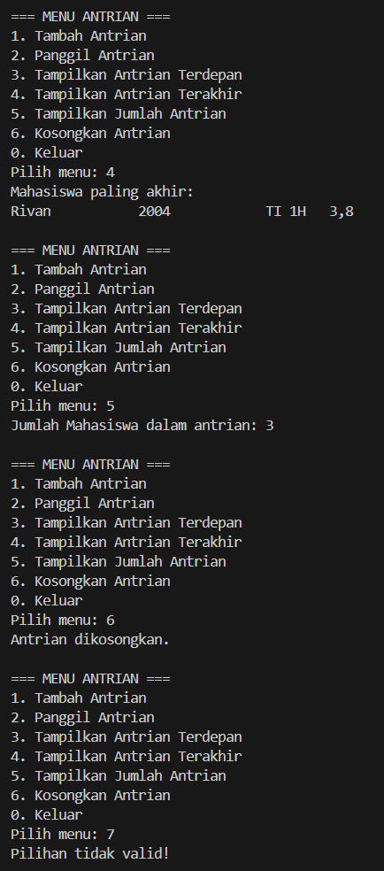
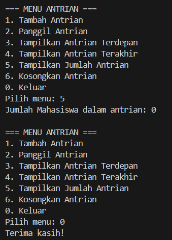

|  | Algoritma dan Struktur Data |
|--|--|
| NIM | 244107020115 |
| Nama | Bintang Pancahaya Prasetyo |
| Kelas | TI - 1H |
| Repository | [link](https://github.com/BintangPancahaya/AlgoritmaStrukturData/tree/main/Jobsheet11) |

# JOBSHEET 11

## Praktikum 1: Single Linked List

### Hasil Kode Program



### 2.1.2 Pertanyaan

1. **Mengapa hasil compile di baris pertama menghasilkan “Linked List Kosong”?**

    - **Jawaban**  
      Karena saat program pertama kali dijalankan, belum ada node yang ditambahkan ke dalam linked list. `head` masih bernilai `null`, sehingga method `isEmpty()` akan mengembalikan nilai `true` dan mencetak pesan “Linked List Kosong”.

2. **Jelaskan kegunaan variabel `temp` secara umum pada setiap method!**

    - **Jawaban**  
      Variabel `temp` digunakan sebagai pointer bantu untuk menelusuri linked list dari node `head` hingga akhir. Tujuannya adalah agar node-node dalam list bisa diakses tanpa mengubah pointer utama `head`.

3. **Modifikasi program agar data mahasiswa dapat ditambahkan melalui input dari keyboard!**

    - **Jawaban**  
      Tambahkan `Scanner` untuk membaca input pengguna dalam `SLLMain12.java`:
      
      ```java
      public static Mahasiswa05 input() {
      Scanner sc = new Scanner(System.in);
      System.out.print("NIM: ");
      String nim = sc.nextLine();
      System.out.print("Nama: ");
      String nama = sc.nextLine();
      System.out.print("Kelas: ");
      String kelas = sc.nextLine();
      System.out.print("IPK: ");
      double ipk = Double.parseDouble(sc.nextLine());
      return new Mahasiswa05(nim, nama, kelas, ipk);
      }
      ```
    - Ganti tiap method memasukkan data dengan input().
    ```java
    sll.addFirst(input());
    sll.addLast(input());
    sll.insertAfter("Dirga", input());
    sll.insertAt(2, input());
    ```

## Praktikum 2: Modifikasi dan Penghapusan Node

### Hasil Kode Program



### 2.2.3 Pertanyaan

1. **Mengapa digunakan keyword `break` pada fungsi remove?**

    - **Jawaban**  
      Keyword `break` digunakan untuk menghentikan proses perulangan setelah node yang dicari berhasil ditemukan dan dihapus. Ini menghindari perulangan yang tidak perlu setelah operasi selesai.

2. **Jelaskan kegunaan kode berikut pada method remove:**

    ```java
    if (temp.next.data.getNim().equals(key)) {
        temp.next = temp.next.next;
        size--;
        break;
    }
    ```

    - **Jawaban**  
      Potongan kode tersebut mengecek apakah node setelah `temp` adalah node yang ingin dihapus (berdasarkan `NIM`). Jika cocok, maka node tersebut dilewati (dihapus dari list) dengan cara menunjuk `temp.next` langsung ke `temp.next.next`. Ukuran list dikurangi dan perulangan dihentikan dengan `break`.

## Langkah-langkah Program Saya

### 1. Program `QueueLinkedList05.java`

**Deskripsi**:  
Merepresentasikan struktur data antrian (queue) menggunakan struktur *linked list*.

**Atribut dan Kelas**:
- `Node` – kelas nested untuk node antrian, berisi atribut `data` dan `next`
- `front` – menunjuk ke elemen paling depan antrian  
- `rear` – menunjuk ke elemen paling belakang antrian  

**Method**:
- `isEmpty()` – memeriksa apakah antrian kosong  
- `enqueue(int data)` – menambahkan elemen ke belakang antrian  
- `dequeue()` – menghapus elemen dari depan antrian  
- `peek()` – menampilkan elemen terdepan tanpa menghapusnya  
- `print()` – mencetak semua elemen dalam antrian  

### 2. Program `QueueDemo05.java`

**Deskripsi**:  
Program utama untuk mendemonstrasikan operasi dasar queue menggunakan struktur *linked list*.

**Alur Program**:
- Membuat objek dari kelas `QueueLinkedList05`
- Melakukan beberapa operasi `enqueue` untuk menambahkan data ke antrian
- Menampilkan isi antrian menggunakan `print()`
- Melakukan operasi `dequeue` untuk menghapus elemen dari antrian
- Menampilkan isi antrian setelah penghapusan
- Menampilkan elemen terdepan menggunakan `peek()`


**Hasil Kode Program**




