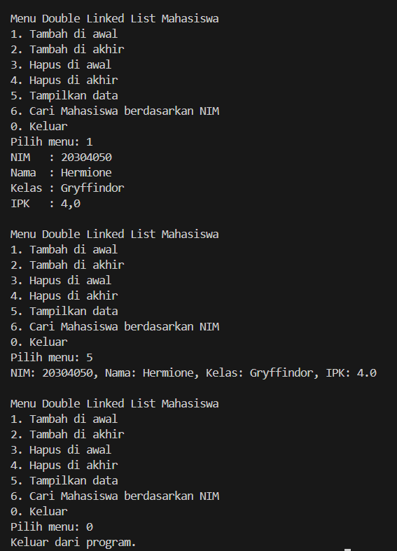
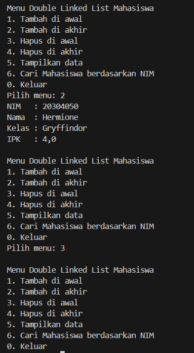
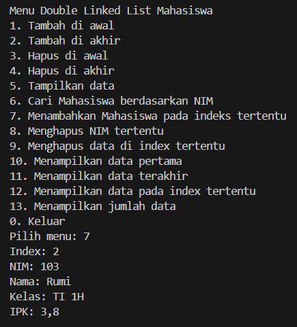
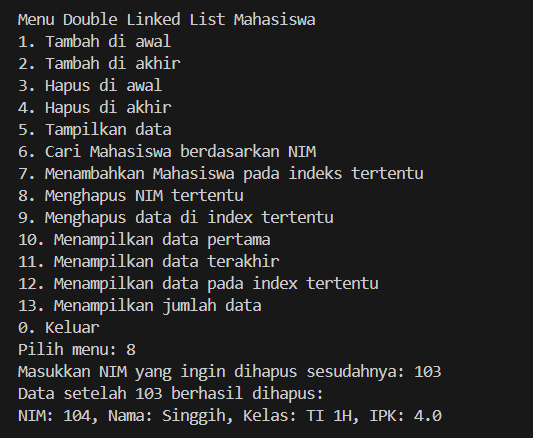
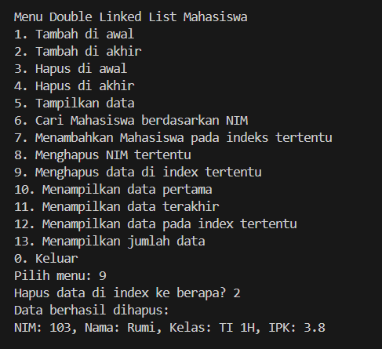
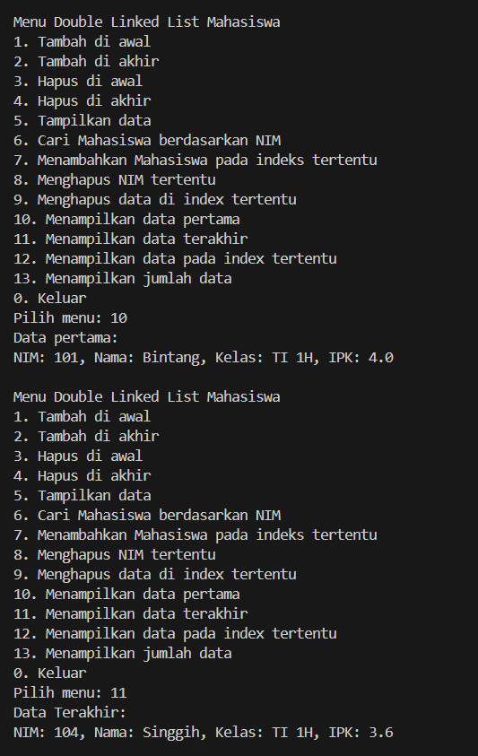
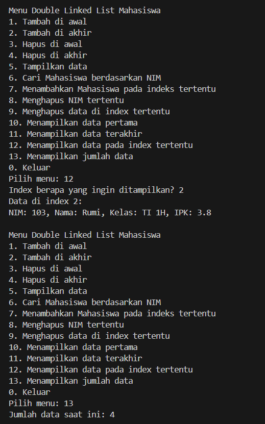

|  | Algoritma dan Struktur Data |
|--|--|
| NIM | 244107020115 |
| Nama | Bintang Pancahaya Prasetyo |
| Kelas | TI - 1H |
| Repository | [link](https://github.com/BintangPancahaya/AlgoritmaStrukturData/tree/main/Jobsheet12) |

# JOBSHEET 12

## Praktikum 1: Double Linked List

### Hasil Kode Program



### 12.2.3 Pertanyaan Percobaan

1. **Jelaskan perbedaan antara Single Linked List dengan Double Linked List!**

   - **Jawaban**  
     - Single Linked List hanya memiliki satu arah (`next`) dari node ke node berikutnya.
     - Double Linked List memiliki dua arah: `next` dan `prev`, sehingga traversal bisa dilakukan dari dua arah (maju dan mundur).

2. **Perhatikan class Node01, di dalamnya terdapat atribut next dan prev. Untuk apakah atribut tersebut?**

   - **Jawaban**  
     - `next` menunjuk ke node berikutnya.
     - `prev` menunjuk ke node sebelumnya, memungkinkan traversal dua arah.

3. **Perhatikan konstruktor pada class DoubleLinkedLists. Apa kegunaan dari konstruktor tersebut?**

   - **Jawaban**  
     Konstruktor menginisialisasi `head` dan `tail` menjadi `null` yang menandakan list masih kosong saat dibuat.

4. **Pada method addFirst(), apa maksud dari kode berikut?**

   ```java
   newNode.next = head;
   head.prev = newNode;
   head = newNode;
   ```

   - **Jawaban**  
     - `newNode.next = head`: menyambungkan node baru ke node lama.
     - `head.prev = newNode`: menyambungkan node lama ke node baru dari arah sebelumnya.
     - `head = newNode`: node baru menjadi node pertama (head).

5. **Pada method addFirst(), apakah arti statement `head.prev = newNode`?**

   - **Jawaban**  
     Mengatur node lama (`head`) agar menunjuk kembali ke node baru (relasi dua arah).

6. **Modifikasi code pada fungsi print() agar dapat menampilkan warning/pesan bahwa linked list masih dalam kondisi kosong.**

   - **Jawaban**  
     Tambahkan logika pengecekan seperti berikut:
     ```java
     if (isEmpty()) {
         System.out.println("Linked list kosong");
     } else {
         Node05 current = head;
            while (current != null) {
                current.data.tampil();
                current = current.next;
            }
     }
     ```

7. **Pada insertAfter(), apa maksud dari kode berikut?**

   ```java
   current.next.prev = newNode;
   ```

   - **Jawaban**  
     Menyambungkan node setelah `current` agar menunjuk balik ke `newNode`. Ini mempertahankan hubungan dua arah antar node.

8. **Modifikasi menu pilihan dan switch-case agar fungsi insertAfter() masuk ke dalam menu pilihan dan dapat berjalan dengan baik.**

   - **Jawaban**  
     Tambahkan pada bagian switch-case:
     ```java
     case 7:
         System.out.print("Masukkan NIM key: ");
         String key = sc.next();
         System.out.print("Masukkan NIM: ");
         String nim = sc.next();
         System.out.print("Masukkan nama: ");
         String nama = sc.next();
         System.out.print("Masukkan kelas: ");
         String kelas = sc.next();
         System.out.print("Masukkan IPK: ");
         double ipk = sc.nextDouble();
         list.insertAfter(key, new Mahasiswa05(nim, nama, kelas, ipk));
         break;
     ```

## Praktikum 2: Operasi Hapus pada Double Linked List

### Hasil Kode Program



### 12.3.3 Pertanyaan Percobaan

1. **Apakah maksud statement berikut pada method removeFirst()?**

   ```java
   head = head.next;
   head.prev = null;
   ```

   - **Jawaban**  
     - `head = head.next`: menunjuk ke node setelah node yang dihapus.
     - `head.prev = null`: memutus hubungan node baru dengan node yang sudah dihapus dari sisi kiri (previous).

2. **Modifikasi kode program untuk menampilkan pesan “Data sudah berhasil dihapus. Data yang terhapus adalah … “**

   - **Jawaban**  
     Simpan data terlebih dahulu sebelum dihapus dan tampilkan:
     ```java
     Mahasiswa05 removed = head.data;
     head = head.next;
     if (head != null) head.prev = null;
     System.out.println("Data sudah berhasil dihapus. Data yang terhapus adalah:");
     removed.tampil();
     ```

## Langkah-langkah Kode Program Saya

### 1. Program `Mahasiswa05.java`

**Deskripsi**:  
Kelas ini berisi atribut data mahasiswa seperti `nim`, `nama`, `kelas`, dan `ipk`.

**Atribut**:
- `String nim`
- `String nama`
- `String kelas`
- `double ipk`

**Method**:
- `tampil()` – menampilkan detail data mahasiswa.

---

### 2. Program `Node05.java`

**Deskripsi**:  
Mewakili struktur simpul pada double linked list yang menyimpan objek Mahasiswa05 dan memiliki dua pointer: `prev` dan `next`.

**Atribut**:
- `Mahasiswa05 data`
- `Node05 prev`
- `Node05 next`

**Constructor**:
- Menginisialisasi data dan pointer `prev` dan `next`.

---

### 3. Program `DoubleLinkedLists.java`

**Deskripsi**:  
Kelas utama untuk implementasi double linked list yang mendukung operasi dasar dan tambahan seperti insert, delete, dan search.

**Method utama**:
- `isEmpty()` – mengecek apakah list kosong.
- `addFirst()`, `addLast()` – menambah data di depan/belakang.
- `insertAfter(String key, Mahasiswa05 mhs)` – menyisipkan data setelah node tertentu.
- `print()` – menampilkan isi linked list.
- `removeFirst()`, `removeLast()` – menghapus node pertama/terakhir.
- `add(Mahasiswa05 data, int index)` – menyisipkan data pada indeks tertentu.
- `removeAfter(String key)` – menghapus node setelah key tertentu.
- `remove(int index)` – menghapus data pada indeks tertentu.
- `getFirst()`, `getLast()`, `getIndex(int index)` – mengakses data di posisi tertentu.
- `size()` – menghitung jumlah node di list.

---

### 4. Program `DoubleLinkedListsMain.java`

**Deskripsi**:  
Program utama yang menyediakan menu interaktif berbasis `Scanner` untuk memanggil fungsi-fungsi dari `DoubleLinkedLists`.

**Menu**:
- Tambah data (depan, belakang, setelah key, atau di indeks).
- Hapus data (depan, belakang, setelah key, atau di indeks).
- Tampilkan semua data.
- Lihat data pertama, terakhir, atau pada indeks tertentu.
- Hitung jumlah data.
- Keluar dari program.

### Hasil Kode Program





