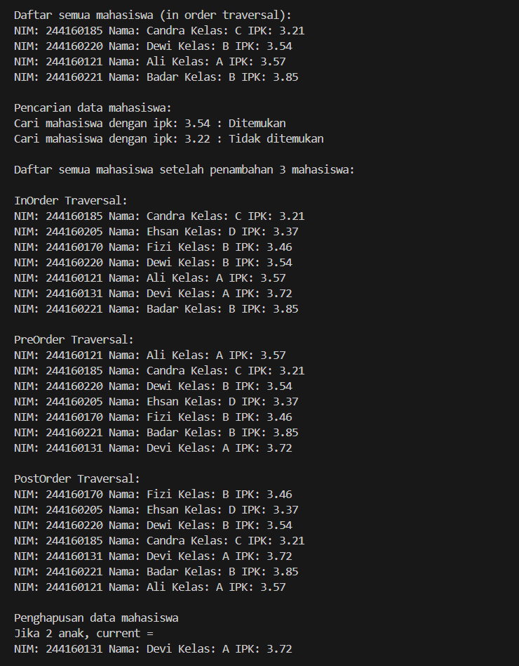
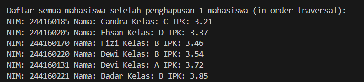
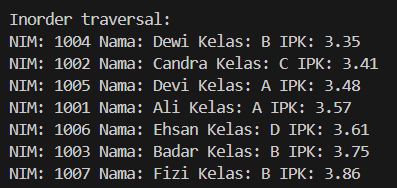
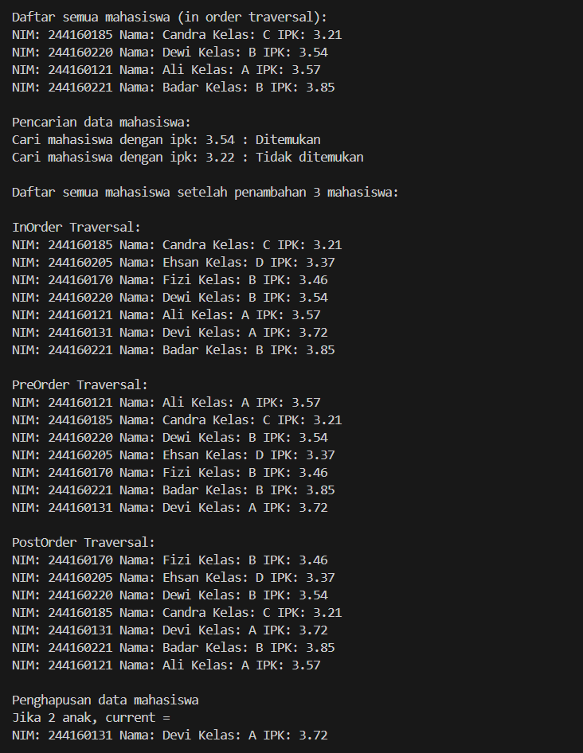
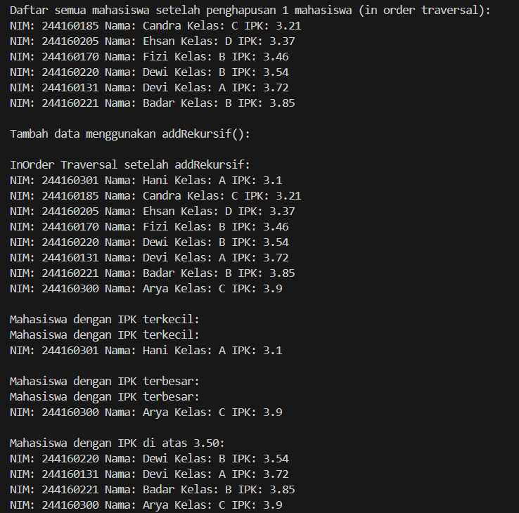

|  | Algoritma dan Struktur Data |
|--|--|
| NIM | 244107020115 |
| Nama | Bintang Pancahaya Prasetyo |
| Kelas | TI - 1H |
| Repository | [link](https://github.com/BintangPancahaya/AlgoritmaStrukturData/tree/main/Jobsheet14) |

# JOBSHEET 14

## Praktikum 1: Binary Search Tree (Linked List)

### Hasil Kode Program




### 14.2.2 Pertanyaan

1. **Mengapa dalam binary search tree proses pencarian data bisa lebih efektif dilakukan dibanding binary tree biasa?**

   - **Jawaban**  
     Karena struktur Binary Search Tree menyimpan data secara terurut (kiri < root < kanan), maka proses pencarian dapat dilakukan dengan cara membandingkan nilai dan mengarah langsung ke sub-tree kiri atau kanan, seperti pencarian biner.

2. **Untuk apakah di class Node, kegunaan dari atribut `left` dan `right`?**

   - **Jawaban**  
     Atribut `left` menunjuk ke node anak kiri dan `right` menunjuk ke node anak kanan. Keduanya digunakan untuk membentuk struktur tree bercabang yang menyimpan data dalam hirarki.

3. a. **Untuk apakah kegunaan dari atribut `root` di dalam class BinaryTree?**

   - **Jawaban**  
     Atribut `root` berfungsi sebagai titik awal atau node utama dari tree. Semua traversal dan operasi lain dalam tree dimulai dari node ini.

   b. **Ketika objek tree pertama kali dibuat, apakah nilai dari `root`?**

   - **Jawaban**  
     Nilainya adalah `null`, karena tree masih kosong dan belum ada node yang ditambahkan.

4. **Ketika tree masih kosong, dan akan ditambahkan sebuah node baru, proses apa yang akan terjadi?**

   - **Jawaban**  
     Node yang baru akan langsung menjadi root dari tree karena tidak ada node sebelumnya.

5. **Perhatikan method `add()`, di dalamnya terdapat baris program seperti berikut. Jelaskan secara detil untuk apa baris program tersebut?**

   ```java
    parent = current;
    if (mahasiswa.ipk < current.mahasiswa.ipk){
    current = current.left;
    if(current == null){
        parent.left = newNode;
    return;
    }
        } else {
            current = current.right;
            if(current == null){
            parent.right = newNode;
            return;
        }
    }
    ```
    - **Jawaban**  
     Baris tersebut digunakan untuk menentukan posisi node baru berdasarkan IPK. Jika IPK lebih kecil dari node saat ini (current), maka data akan ditempatkan di anak kiri. Jika lebih besar atau sama, maka ditempatkan di anak kanan.

6. **Jelaskan langkah-langkah pada method delete() saat menghapus sebuah node yang memiliki dua anak. Bagaimana method getSuccessor() membantu dalam proses ini?**

    - **Jawaban**  
     Saat node yang ingin dihapus memiliki dua anak,
     cari successor node yaitu node dengan nilai IPK terkecil dari subtree kanan.
     Ganti data node yang akan dihapus dengan data dari successor.
     Hapus successor dari posisi aslinya.
     getSuccessor() membantu menemukan node pengganti (successor) dengan menelusuri anak kanan dari node yang akan dihapus, kemudian terus ke kiri hingga mencapai node paling kiri.

## Praktikum 2: Binary Tree dengan Array

### Hasil Kode Program



### 14.3.2 Pertanyaan

1. **Apakah kegunaan dari atribut data dan idxLast yang ada di class BinaryTreeArray?**

    - **Jawaban**  
     data adalah array yang menyimpan node-node tree.
     idxLast adalah indeks terakhir dari elemen yang sudah diisi, digunakan untuk mengontrol jumlah node dan traversal.

2. **Apakah kegunaan dari method populateData()?**

    - **Jawaban**  
     Untuk mengisi array tree dengan data awal sebelum dilakukan traversal.

3. **Apakah kegunaan dari method traverseInOrder()?**

    - **Jawaban**  
     Untuk menampilkan data node secara terurut dari kiri - root kanan (in-order traversal).

4. **Jika suatu node binary tree disimpan dalam array indeks 2, maka di indeks berapakah posisi left child dan right child masing-masing?**

    - **Jawaban**  
     Left child: 2 * 2 + 1 = 5  
     Right child: 2 * 2 + 2 = 6

5. **Apa kegunaan statement int idxLast = 6; pada praktikum 2 percobaan nomor 4?**

    - **Jawaban**  
     Menandakan bahwa data dalam array hanya sampai indeks ke-5 (6 elemen), agar traversal tidak melewati batas data yang ada.

6. **Mengapa indeks 2*idxStart+1 dan 2*idxStart+2 digunakan dalam pemanggilan rekursif, dan apa kaitannya dengan struktur pohon biner yang disusun dalam array?**

    - **Jawaban**  
     Karena dalam representasi array, anak kiri dari node di indeks i berada di 2*i + 1 sedangkan anak kanan berada di 2*i + 2

## Langkah - langkah Kode Program

### Hasil Kode Program


