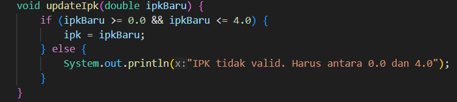
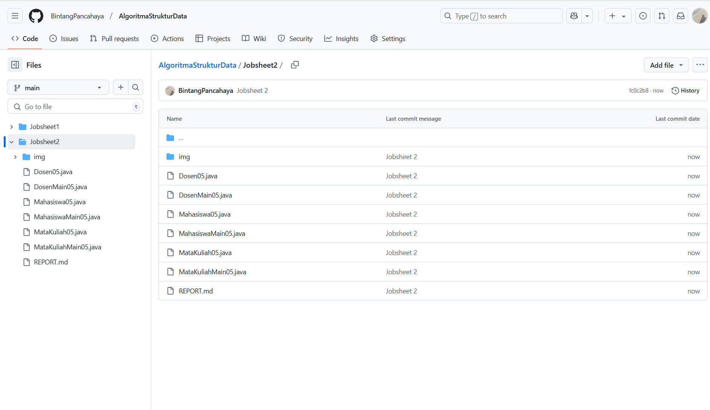
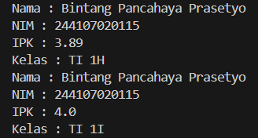
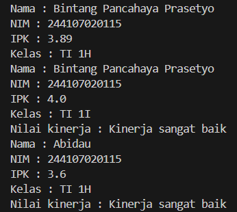
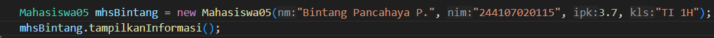
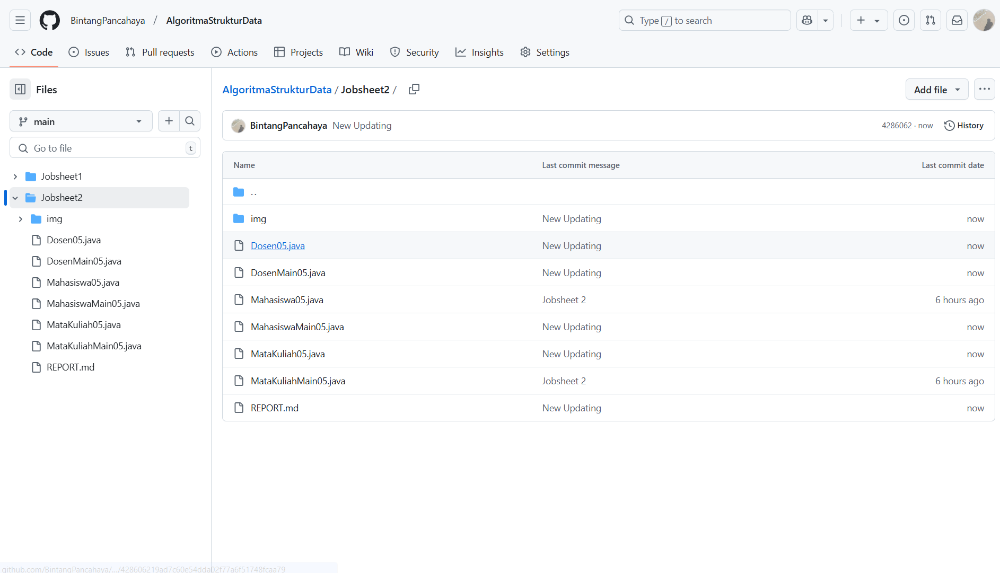
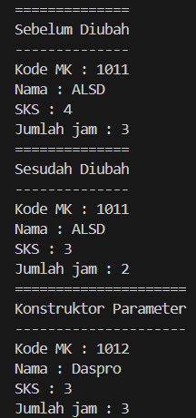
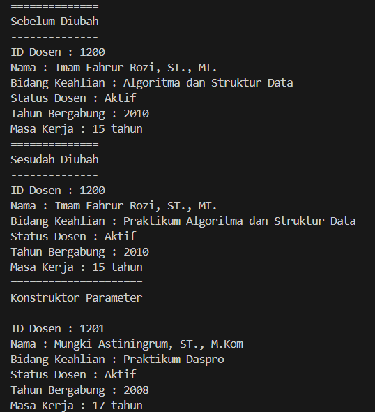

|  | Algoritma dan Struktur Data |
|--|--|
| NIM |  244107020115|
| Nama |  Bintang Pancahaya Prasetyo |
| Kelas | TI - 1H |
| Repository | [link] (https://github.com/BintangPancahaya/AlgoritmaStrukturData/tree/main/Jobsheet2) |

# JOBSHEET 2

## 2.1.2 Verifikasi Hasil Percobaan

Hasil Verifikasi Percobaan


## 2.1.3 Pertanyaan

1. Sebutkan dua karakteristik class atau object!
2. Perhatikan class Mahasiswa pada Praktikum 1 tersebut, ada berapa atribut yang dimiliki oleh class
Mahasiswa? Sebutkan apa saja atributnya!
3. Ada berapa method yang dimiliki oleh class tersebut? Sebutkan apa saja methodnya!
4. Perhatikan method updateIpk() yang terdapat di dalam class Mahasiswa. Modifikasi isi method
tersebut sehingga IPK yang dimasukkan valid yaitu terlebih dahulu dilakukan pengecekan apakah
IPK yang dimasukkan di dalam rentang 0.0 sampai dengan 4.0 (0.0 <= IPK <= 4.0). Jika IPK tidak
pada rentang tersebut maka dikeluarkan pesan: "IPK tidak valid. Harus antara 0.0 dan 4.0".
5. Jelaskan bagaimana cara kerja method nilaiKinerja() dalam mengevaluasi kinerja mahasiswa,
kriteria apa saja yang digunakan untuk menentukan nilai kinerja tersebut, dan apa yang
dikembalikan (di-return-kan) oleh method nilaiKinerja() tersebut?
6. Commit dan push kode program ke Github


#### JAWABAN

1. Karakterisik Object :  
a. Mempunyai sesuatu, contoh : Data, Properti, Variabel, Atribut.  
b. Melakukan sesuatu, contoh : Tingkah laku, Fungsi, Method.  
Karakteristik Class :
2. Ada 4 atribut. String nama, String nim, String kelas, double ipk
3. Ada 4 method. void tampilkanInformasi(), void ubahKelas(), void updateIpk(), String nilaiKinerja().
4. Hasil screenshot modifikasi 

5. Pertama method nilaiKinerja() akan menerima parameter double ipk. Kemudian kriteria yang digunakan jika ipk >= 3.5 Kinerja sangat baik, ipk 3.0 - 3.49 Kinerja baik, ipk 2.0 - 2.99 Kinerja cukup, ipk < 2 Kinerja kurang. Method ini mengembalikan nilai berupa string yang menjelaskan tingkat kinerja mahasiswa.
6. Hasil screenshot push ke github


## 2.2.2 Verifikasi Hasil Percobaan

Hasil Verifikasi Percobaan


## 2.2.3 Pertanyaan

1. Pada class MahasiswaMain, tunjukkan baris kode program yang digunakan untuk proses
instansiasi! Apa nama object yang dihasilkan?
2. Bagaimana cara mengakses atribut dan method dari suatu objek?
3. Mengapa hasil output pemanggilan method tampilkanInformasi() pertama dan kedua berbeda?

#### JAWABAN

1. Baris kode program yang menunjukkan instansiasi
```
Mahasiswa05 mhs1 = new Mahasiswa05(); 
Mahasiswa05 mhs2 = new Mahasiswa05("Abidau","244107020115", 3.5, "TI 1H");
```
Pada baris pertama, objek mhs1 dibuat menggunakan konstruktor tanpa parameter (default).  
Pada baris kedua, objek mhs2 dibuat menggunakan konstruktor dengan parameter.

2. Dengan cara menggunakan operator titik (.) setelah nama objek. Contoh:   
`mhs1.kelas = "TI 1I";
mhs1.tampilkanInformasi();`
3. Hasilnya berbeda karena ada perubahan nilai pada atribut objek mhs1 sebelum pemanggilan kedua.

## 2.3.2 Verifikasi Hasil Percobaan

Hasil Verifikasi Percobaan



## 2.3.3 Pertanyaan

1. Pada class Mahasiswa di Percobaan 3, tunjukkan baris kode program yang digunakan untuk
mendeklarasikan konstruktor berparameter!
2. Perhatikan class MahasiswaMain. Apa sebenarnya yang dilakukan pada baris program
berikut?
3. Hapus konstruktor default pada class Mahasiswa, kemudian compile dan run program.
Bagaimana hasilnya? Jelaskan mengapa hasilnya demikian!
4. Setelah melakukan instansiasi object, apakah method di dalam class Mahasiswa harus diakses
secara berurutan? Jelaskan alasannya!
5. Buat object baru dengan nama mhs<NamaMahasiswa> menggunakan konstruktor
berparameter dari class Mahasiswa!
6. Commit dan push kode program ke Github

#### JAWABAN

1. Baris kode yang menunjukkan konstruktor berparameter
```
public Mahasiswa05(String nm, String nim, double ipk, String kls) {
    nama = nm;
    this.nim = nim;
    this.ipk = ipk;
    kelas = kls;
}
```
2. Baris ini membuat objek mhs2 dari class Mahasiswa05.
Konstruktor berparameter dipanggil untuk langsung mengisi atribut nama, nim, ipk, dan kelas.
Objek mhs2 akan memiliki nilai awal sesuai parameter yang diberikan.
3. Jika konstruktok default di hapus maka saat program mencoba membuat mhs1 dengan new Mahasiswa05();, terjadi error karena tidak ada konstruktor yang cocok.
4. Tidak harus. Method dalam Mahasiswa05 bisa dipanggil dalam urutan yang tidak tetap, tergantung kebutuhan.
5. Menambahkan objek mhs dengan nama mahasiswa

6. Hasil screenshot Github



## 2.4 Latihan Praktikum
### Tugas 1

Hasil Kode Program Pada Tugas Nomer 1



Langkah-Langkah Kode Pemograman saya :
1. Pada class Matakuliah05 mendeklarasi atribut `String kodeMk, String nama, int sks, dan int jumlahJam` untuk menyimpan data mata kuliah.  
Membuat method:  
`tampilInformasi()` → Menampilkan detail mata kuliah.  
`ubahSKS(int sksBaru)` → Mengubah jumlah SKS.  
`tambahJam(int jam)` → Menambahkan jumlah jam kuliah.  
`kurangiJam(int jam)` → Mengurangi jumlah jam kuliah (hanya jika jam lebih kecil dari jumlahJam).  
Konstruktor:  
Tanpa parameter → Untuk membuat objek tanpa langsung mengisi data.  
Dengan parameter → Mempermudah pengisian langsung saat objek dibuat.

2. Pada class MataKuliahMain05 membuat objek matkul1 dengan konstruktor default, mengisi data mata kuliah secara manual. Menampikan informasi awal sebelum perubahan, lalu mengubah nilai atribut matkul1, terakhir menampilkan informasi setelah perubahan.

3. Membuat objek matkul2 dengan konstruktor berparameter, langsung mengisi data mata kuliah, kemudian menampilkan informasi.

### Tugas 2

Hasil Kode Program Pada Tugas Nomer 2



Langkah-Langkah Kode Pemograman saya :
1. Pada class Dosen05 mendeklarasi atribut `String idDosen, String nama, String bidangKeahlian, boolean statusAktif, int tahunBergabung, dan int masaKerja.`  
Membuat method:  
`tampilInformasi()` → Menampilkan data dosen.  
`setStatusAktif(boolean setStatus)` → Mengubah status aktif/tidak aktif.  
`hitungMasaKerja(int tahunBergabung, int tahunSekarang)` → Menghitung masa kerja berdasarkan tahun.  
`ubahKeahlian(String bidangAhli)` → Mengubah bidang keahlian dosen.  
Konstruktor:  
Tanpa parameter → Untuk membuat objek tanpa langsung mengisi data.  
Dengan parameter → Mempermudah pengisian langsung saat objek dibuat.

2. Pada class DosenMain05 membuat objek dosen1 dengan konstruktor default, mengisi data atau mengisi atribut secara manual, lalu menghitung masaKerja berdasarkan tahun bergabung dan tahun sekarang. Menampikan informasi awal sebelum perubahan, lalu mengubah bidang keahlian, terakhir menampilkan informasi setelah perubahan.

3. Membuat objek dosen2 dengan konstruktor berparameter, langsung mengisi atribut, lalu mengubah bidang keahlian dan kemudian menampilkan informasi.