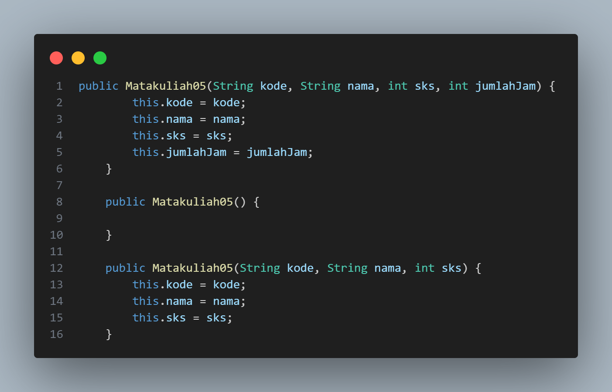
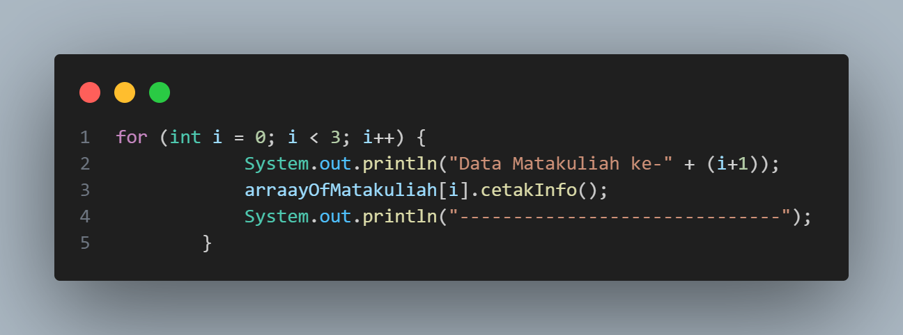
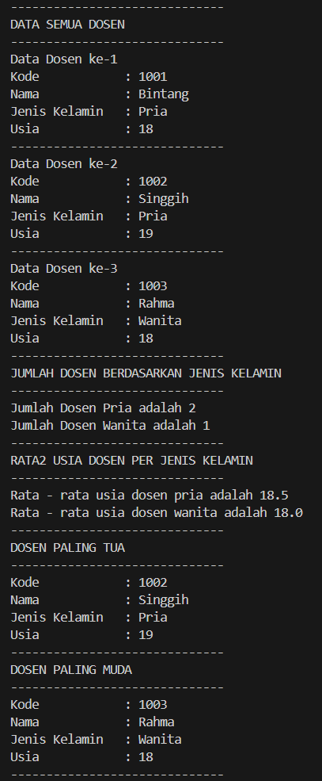

|  | Algoritma dan Struktur Data |
|--|--|
| NIM |  244107020115|
| Nama |  Bintang Pancahaya Prasetyo |
| Kelas | TI - 1H |
| Repository | [link] (https://github.com/BintangPancahaya/AlgoritmaStrukturData/tree/main/Jobsheet3) |

# JOBSHEET 3

## 3.2 Membuat Array dari Object, Mengisi dan Menampilkan

Hasil Kode Program 

### 3.2.3 Pertanyaan

1. Tidak, sebuah class bisa saja hanya memiliki atribut tanpa method, atau hanya memiliki method tanpa atribut. Biasanya class yang dibuat untuk array of objects memiliki atribut untuk menyimpan data dan method untuk melakukan sesuatu dengan data tersebut. Atribut digunakan untuk menyimpan informasi, sedangkan method digunkana untuk melakukan sebuah proses dari informasi tersebut.

2. `Mahasiswa[] arrayOfMahasiswa` mendeklarasikan sebuah array yang akan menyimpan objek-objek dari kelas Mahasiswa.

    `new Mahasiswa[3]` membuat array dengan ukuran 3, yang berarti array ini dapat menampung tiga objek Mahasiswa.

3. Jika class Mahasiswa tidak memiliki konstruktor, Java secara otomatis memberikan konstruktor default yang tidak memerlukan parameter. Jika ada konstruktor yang dibuat dengan parameter, harus memanggilnya dengan memberikan nilai yang sesuai.

4. Kode program ini membuat sebuah array yang berisi tiga objek dari class Mahasiswa. Setiap objek diisi dengan informasi data mahasiswa seperti NIM, nama, kelas, dan IPK.

5. Dipisah karena untuk membuat kode lebih teratur dan mudah dipahami. Class Mahasiswa berfungsi untuk mendefinisikan data dan perilaku yang berkaitan dengan mahasiswa, seperti atribut NIM, nama, kelas, dan IPK. Sedangkan, class MahasiswaDemo digunakan untuk menjalankan program dan menguji class Mahasiswa.

## 3.3 Menerima Input Isian Array Menggunakan Looping

Hasil Kode Pemrograman

### 3.3.3 Pertanyaan

1. Jawaban

Kode class Mahasiswa05

Kode class MahasiswaDemo05

2. Jika mencoba menggunakan array myArrayOfMahasiswa tanpa menginstansiasi terlebih dahulu, maka kode tersebut akan menyebabkan error karena tidak dapat mengakses elemen dari array yang belum dibuat.

## 3.4 Constructor Berparameter

Hasil Kode Pemrograman

### 3.4.3 Pertanyaan

1. Ya, sebuah class dapat memiliki lebih dari satu constructor.

2. Jawaban

Kode class Matakuliah

Kode class MatakuliahDemo

3.  Jawaban

kode class Matakuliah

Kode class MatakuliahDemo

4. Jawaban

## 3.5 Tugas

1. Hasil Kode Pemrograman 

2. Hasil Kode Pemrograman

