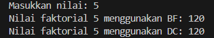
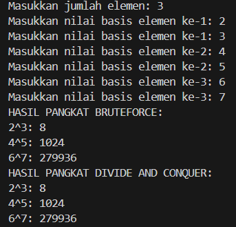
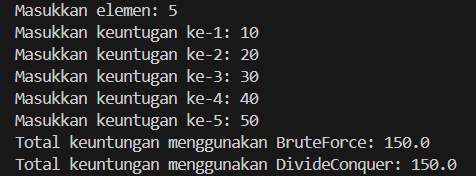
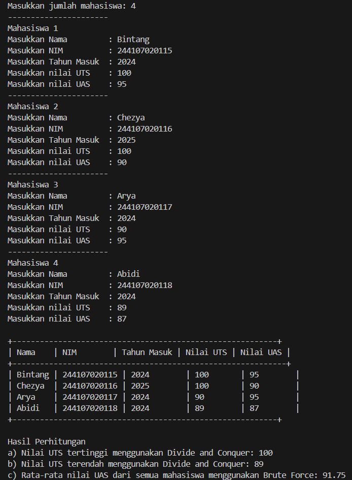

|  | Algoritma dan Struktur Data |
|--|--|
| NIM |  244107020115|
| Nama |  Bintang Pancahaya Prasetyo |
| Kelas | TI - 1H |
| Repository | [link] (https://github.com/BintangPancahaya/AlgoritmaStrukturData/tree/main/Jobsheet5) |

# JOBSHEET 5

## 5.2 Menghitung Nilai Faktorial dengan Algoritma Brute Force dan Divide and Conquer

Hasil Kode Program 


### Pertanyaan dan Jawaban

#### 5.2.3. Pertanyaan

1. **Pada base line Algoritma Divide Conquer untuk melakukan pencarian nilai faktorial, jelaskan perbedaan bagian kode pada penggunaan if dan else!**

   - **Jawaban:**  
     Penggunaan `if` dan `else` berfungsi untuk membagi masalah menjadi sub-masalah yang lebih kecil. Jika `n == 1` (base case), maka fungsi akan langsung mengembalikan nilai 1. Namun, jika `n` tidak sama dengan 1, fungsi akan memanggil dirinya sendiri dengan parameter `n-1` (rekursi) dan mengalikan hasilnya dengan `n`. Di mana masalah besar dipecah menjadi masalah yang lebih kecil hingga mencapai base case.

2. **Apakah memungkinkan perulangan pada method `faktorialBF()` diubah selain menggunakan `for`? Buktikan!**

   - **Jawaban:**  
     Ya, perulangan pada method `faktorialBF()` bisa diubah menggunakan perulangan `while` atau `do-while`. Contohnya menggunakan `while`:
     ```java
     int faktorialBF(int n) {
         int fakto = 1;
         int i = 1;
         while (i <= n) {
             fakto *= i;
             i++;
         }
         return fakto;
     }
     ```

3. **Jelaskan perbedaan antara `fakto *= i;` dan `int fakto = n * faktorialDC(n-1);`!**

   - **Jawaban:**  
     - `fakto *= i;` adalah operasi iteratif yang mengalikan nilai `fakto` dengan `i` secara berulang dalam sebuah loop. Ini adalah pendekatan Brute Force yang menghitung faktorial secara langsung dengan mengalikan semua bilangan dari 1 hingga `n`.
     - `int fakto = n * faktorialDC(n-1);` adalah operasi rekursif yang memanggil fungsi `faktorialDC` dengan parameter `n-1` dan mengalikan hasilnya dengan `n`. Ini adalah pendekatan Divide and Conquer yang memecah masalah menjadi sub-masalah yang lebih kecil.

4. **Buat Kesimpulan tentang perbedaan cara kerja method `faktorialBF()` dan `faktorialDC()`!**

   - **Jawaban:**  
     - **`faktorialBF()`** menggunakan pendekatan iteratif dengan perulangan `for` atau `while` untuk menghitung faktorial secara langsung. Ini adalah pendekatan Brute Force yang sederhana dan mudah dipahami.
     - **`faktorialDC()`** menggunakan pendekatan rekursif dengan membagi masalah menjadi sub-masalah yang lebih kecil (Divide and Conquer).

## 5.3 Menghitung Hasil Pangkat dengan Algoritma Brute Force dan Divide and Conquer

Hasil Kode Program


#### 5.3.3. Pertanyaan

1. **Jelaskan mengenai perbedaan 2 method yang dibuat yaitu `pangkatBF()` dan `pangkatDC()`!**

   - **Jawaban:**  
     - **`pangkatBF()`** menggunakan pendekatan iteratif dengan perulangan `for` untuk menghitung pangkat secara langsung. Ini adalah pendekatan Brute Force yang mengalikan bilangan secara berulang.
     - **`pangkatDC()`** menggunakan pendekatan rekursif dengan membagi masalah menjadi sub-masalah yang lebih kecil (Divide and Conquer). Jika pangkat adalah bilangan ganjil, hasilnya dikalikan dengan bilangan itu sendiri, sedangkan jika pangkat adalah bilangan genap, hasilnya dikalikan dengan dirinya sendiri.

2. **Apakah tahap *combine* sudah termasuk dalam kode tersebut? Tunjukkan!**

   - **Jawaban:**  
     Ya, tahap *combine* sudah termasuk dalam kode `pangkatDC()`.
     ```java
     return (pangkatDC(a, n/2) * pangkatDC(a, n/2) * a);
     return (pangkatDC(a, n/2) * pangkatDC(a, n/2));
     ```

3. **Pada method `pangkatBF()` terdapat parameter untuk melewatkan nilai yang akan dipangkatkan dan pangkat berapa, padahal di sisi lain di class `Pangkat` telah ada atribut `nilai` dan `pangkat`, apakah menurut Anda method tersebut tetap relevan untuk memiliki parameter? Apakah bisa jika method tersebut dibuat dengan tanpa parameter? Jika bisa, seperti apa method `pangkatBF()` yang tanpa parameter?**

   - **Jawaban:**  
     Method `pangkatBF()` tetap relevan memiliki parameter karena masih memungkinkan dalam menghitung pangkat untuk nilai dan pangkat yang berbeda tanpa harus mengubah atribut objek. Namun, jika ingin dibuat tanpa parameter, method tersebut dapat mengakses atribut objek langsung:
     ```java
     int pangkatBF() {
         int hasil = 1;
         for (int i = 0; i < this.pangkat; i++) {
             hasil *= this.nilai;
         }
         return hasil;
     }
     ```

4. **Tarik Kesimpulan tentang cara kerja method `pangkatBF()` dan `pangkatDC()`!**

   - **Jawaban:**  
     - **`pangkatBF()`** menggunakan pendekatan iteratif dengan perulangan untuk menghitung pangkat secara langsung.
     - **`pangkatDC()`** menggunakan pendekatan rekursif dengan membagi masalah menjadi sub-masalah yang lebih kecil (Divide and Conquer).
## 5.4 Menghitung Sum Array dengan Algoritma Brute Force dan Divide and Conquer

Hasil Kode Program



#### 5.4.3. Pertanyaan

1. **Kenapa dibutuhkan variable `mid` pada method `TotalDC()`?**

   - **Jawaban:**  
     Variabel `mid` digunakan untuk membagi array menjadi dua bagian yang lebih kecil. Ini adalah bagian dari pendekatan Divide and Conquer, di mana masalah besar dipecah menjadi sub-masalah yang lebih kecil untuk diselesaikan secara terpisah.

2. **Untuk apakah statement di bawah ini dilakukan dalam `TotalDC()`?**
   ```java
   double lsum = totalDC(arr, l, mid);
   double rsum = totalDC(arr, mid+1, r);
   ```
   
   - **Jawaban:**  
     Statement tersebut digunakan untuk membagi array menjadi dua bagian dan menghitung jumlah masing-masing bagian secara rekursif. `lsum` menghitung jumlah bagian kiri array, sedangkan `rsum` menghitung jumlah bagian kanan array.

3. **Kenapa diperlukan penjumlahan hasil `lsum` dan `rsum` seperti di bawah ini?**
   ```java
   return lsum + rsum;
   ```
   
   - **Jawaban:**  
     Penjumlahan `lsum` dan `rsum` diperlukan untuk menggabungkan hasil dari dua bagian array yang telah dihitung secara terpisah.

4. **Apakah base case dari `totalDC()`?**

   - **Jawaban:**  
     Base case dari `totalDC()` adalah `l == r`, yaitu ketika array hanya memiliki satu elemen. Pada kondisi ini, fungsi akan langsung mengembalikan nilai elemen tersebut.

5. **Tarik Kesimpulan tentang cara kerja `totalDC()`!**

   - **Jawaban:**  
     Method `totalDC()` menggunakan pendekatan Divide and Conquer untuk menghitung total nilai array. Array dibagi menjadi dua bagian yang lebih kecil, dan masing-masing bagian dihitung secara rekursif. Hasil dari kedua bagian kemudian digabungkan untuk mendapatkan total keseluruhan. Dan ini adalah pendekatan yang efisien untuk menghitung jumlah array, terutama untuk array yang besar.

## **Langkah - langkah kode program saya**

### 1. Program `MainTugas.java`

**Meminta Input Jumlah Mahasiswa**
- Program meminta pengguna untuk memasukkan jumlah mahasiswa dan menyimpannya dalam variabel `baris`.

**Membuat Array Objek `Tugas`**
- Membuat array objek `Tugas` dengan panjang sesuai jumlah mahasiswa yang dimasukkan.

**Mengisi Data Mahasiswa**
- Melakukan perulangan untuk mengisi data mahasiswa:
  - Membuat objek `Tugas` baru untuk setiap mahasiswa.
  - Meminta input nama, NIM, tahun masuk, nilai UTS, dan nilai UAS.
  - Menyimpan data tersebut ke dalam objek `Tugas`.

**Membuat Array Nilai UTS dan UAS**
- Membuat dua array `utsArray` dan `uasArray` untuk menyimpan nilai UTS dan UAS dari semua mahasiswa.

**Menampilkan Data Mahasiswa**
- Menampilkan data mahasiswa dalam bentuk tabel yang mencakup nama, NIM, tahun masuk, nilai UTS, dan nilai UAS.

**Menghitung dan Menampilkan Hasil**
- Menghitung dan menampilkan:
  - Nilai UTS tertinggi menggunakan metode Divide and Conquer.
  - Nilai UTS terendah menggunakan metode Divide and Conquer.
  - Rata-rata nilai UAS menggunakan metode Brute Force.

### 2. Program `Tugas.java`

**2.2. Atribut Class `Tugas`**
- Atribut yang dimiliki:
  - `nama`: String untuk menyimpan nama mahasiswa.
  - `nim`: String untuk menyimpan NIM mahasiswa.
  - `tahun`: Integer untuk menyimpan tahun masuk mahasiswa.
  - `uts`: Integer untuk menyimpan nilai UTS mahasiswa.
  - `uas`: Integer untuk menyimpan nilai UAS mahasiswa.

**Method `utsTertinggiDC`**
- Method ini menggunakan algoritma Divide and Conquer untuk mencari nilai UTS tertinggi.
- Parameter:
  - `u[]`: Array nilai UTS.
  - `dummy`: Indeks awal untuk memulai pencarian.
- Return:
  - Nilai UTS tertinggi.

**Method `utsTerendahDC`**
- Method ini menggunakan algoritma Divide and Conquer untuk mencari nilai UTS terendah.
- Parameter:
  - `a[]`: Array nilai UTS.
  - `dummy`: Indeks awal untuk memulai pencarian.
- Return:
  - Nilai UTS terendah.

**Method `rataUasBF`**
- Method ini menggunakan algoritma Brute Force untuk menghitung rata-rata nilai UAS.
- Parameter:
  - `u[]`: Array nilai UAS.
- Return:
  - Rata-rata nilai UAS.

**Alur Program Secara Keseluruhan**
1. Program `MainTugas.java` meminta input jumlah mahasiswa dan data masing-masing mahasiswa.
2. Data mahasiswa disimpan dalam array objek `Tugas`.
3. Program menampilkan data mahasiswa dalam bentuk tabel.
4. Program menghitung dan menampilkan nilai UTS tertinggi, nilai UTS terendah, dan rata-rata nilai UAS menggunakan method yang ada di class `Tugas`.
5. Program selesai dijalankan.

## **HASIL KODE PROGRAM**

