|  | Algoritma dan Struktur Data |
|--|--|
| NIM |  244107020115|
| Nama |  Bintang Pancahaya Prasetyo |
| Kelas | TI - 1H |
| Repository | [link] (https://github.com/BintangPancahaya/AlgoritmaStrukturData/tree/main/Jobsheet6) |

# JOBSHEET 6

## 5.2 Mengimplementasikan Sorting Menggunakan Object

Hasil Kode Program Praktikum 1

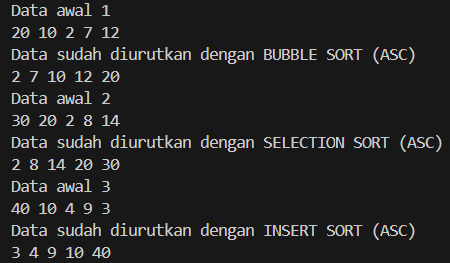

### Pertanyaan dan Jawaban

### 5.2.5 Pertanyaan

1. **Jelaskan fungsi kode program berikut**
   ```java
   if (data[j-1] > data[j]) {
       temp = data[j];
       data[j] = data[j-1];
       data[j-1] = temp;
   }
   ```
    - **Jawaban:**  
     - Kode program tersebut merupakan bagian dari algoritma Bubble Sort yang berfungsi untuk menukar posisi dua elemen yang berdekatan jika elemen sebelumnya lebih besar dari elemen setelahnya. Dan mengurutkan data secara ascending.

2. **Tunjukkan kode program yang merupakan algoritma pencarian nilai minimum pada selection sort!**

    - **Jawaban:**  
     - Berikut kode program pencarian nilai minimum pada Selection Sort:

    ```java
    int min = i;
    for (int j = i+1; j < jumData; j++) {
        if(data[j] < data[min]) {
        min = j;
        }
    }
    ```
3. **Pada Insertion sort, jelaskan maksud dari kondisi pada perulangan `while (j>=0 && data[j]>temp)`**

    - **Jawaban:**
     - Kondisi `(j >= 0 && data[j] > temp)` memiliki dua bagian.

     - Pertama, `j >= 0` memastikan bahwa indeks tidak keluar dari batas array (tidak negatif).

     - Kedua, `data[j] > temp` memeriksa apakah elemen pada posisi j lebih besar dari elemen sementara (temp) yang sedang diproses.

4. **Pada Insertion sort, apakah tujuan dari perintah `data[j+1]=data[j];`**

    - **Jawaban:**
     - Perintah `data[j+1] = data[j];` bertujuan untuk menggeser elemen yang lebih besar dari temp ke kanan, sehingga membuat ruang kosong untuk menempatkan temp pada posisi yang tepat dalam array yang sudah terurut sebagian.

## 5.3 Sorting Menggunakan Array of Object

Hasil Kode Program Praktikum 2

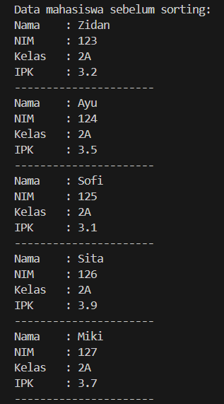
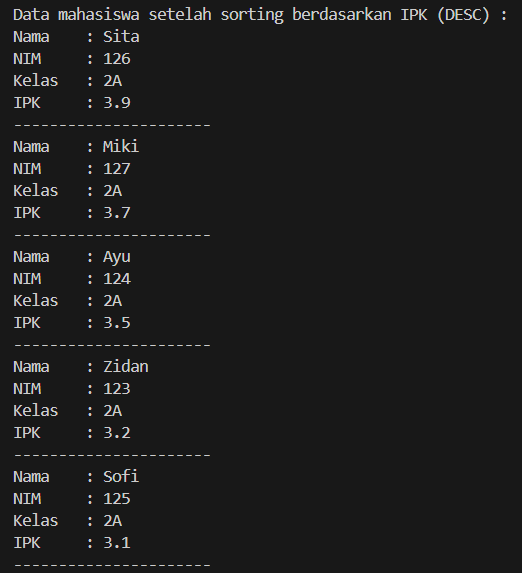
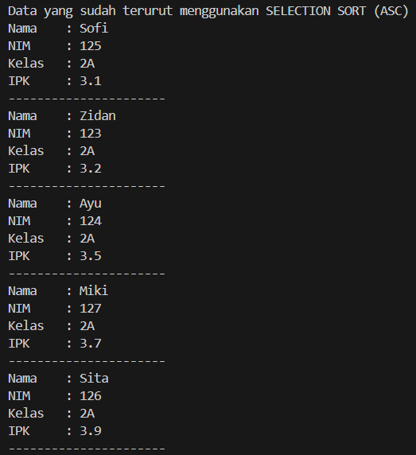
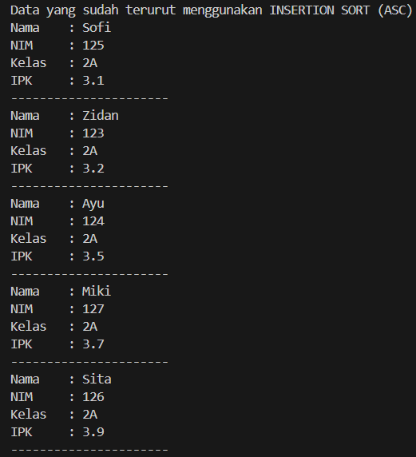

### 5.3.4 Pertanyaan

1. **Perhatikan perulangan di dalam bubbleSort()**

    **a. Mengapa syarat dari perulangan i adalah `i < listMhs.length - 1`?**

    - **Jawaban:**
     - Karena pada Bubble Sort, setelah n-1 iterasi (dimana n adalah jumlah elemen), array pasti sudah terurut. Jadi tidak perlu melakukan iterasi sampai elemen terakhir.

    **b. Mengapa syarat dari perulangan j adalah `j < listMhs.length - 1`?**

    - **Jawaban:**
    - Karena dalam setiap iterasi, kita membandingkan elemen j dengan elemen j+1, sehingga kita tidak perlu sampai ke elemen terakhir untuk menghindari ArrayIndexOutOfBoundsException.

    **c. Jika banyak data di dalam listMhs adalah 50, maka berapa kali perulangan i akan berlangsung? Dan ada berapa tahap bubble sort yang ditempuh?**

    - **Jawaban:**
    - Perulangan i akan berlangsung sebanyak 49 kali (50 - 1), dan akan ada 49 tahap bubble sort yang ditempuh.

2. **Modifikasi program di atas di mana data mahasiswa bersifat dinamis (input dari keyboard) yang terdiri dari nim, nama, kelas, dan ipk!**

    - **Jawaban:**
     - ```java
        import java.util.Scanner;

        public class MahasiswaDemo {
            public static void main(String[] args) {
                Scanner sc = new Scanner(System.in);
                MahasiswaBerprestasi list = new MahasiswaBerprestasi();

                System.out.print("Masukkan jumlah mahasiswa: ");
                int jumlah = sc.nextInt();
                sc.nextLine();

                for(int i = 0; i < jumlah; i++) {
                    System.out.println("Masukkan data mahasiswa ke-" + (i + 1));
                    System.out.print("NIM: ");
                    String nim = sc.nextLine();
                    System.out.print("Nama: ");
                    String nama = sc.nextLine();
                    System.out.print("Kelas: ");
                    String kelas = sc.nextLine();
                    System.out.print("IPK: ");
                    double ipk = sc.nextDouble();
                    sc.nextLine();

                    Mahasiswa m = new Mahasiswa(nim, nama, kelas, ipk);
                    list.tambah(m);
                }
            }
        }
        ```

## 5.3.5 Mengurutkan Data Mahasiswa Berdasarkan IPK (Selection Sort)

### 5.3.7 Pertanyaan
1. **Jelaskan proses berikut dalam method selection sort**
    
    ```java
    int idxMin = i;
    for (int j = i+1; j < listMhs.length; j++) {
        if (listMhs[j].ipk < listMhs[idxMin].ipk) {
            idxMin = j;
        }
    }
    ```
    - **Jawaban:**
     - Proses tersebut bertujuan untuk mencari indeks (idxMin) dari mahasiswa dengan IPK terkecil dalam sisa array yang belum terurut. Dimulai dari indeks i, lalu membandingkan dengan elemen setelahnya. Jika ditemukan IPK yang lebih kecil, idxMin diperbarui. Setelah loop selesai, idxMin berisi indeks elemen dengan IPK terkecil.

## 5.4 Mengurutkan Data Mahasiswa Berdasarkan IPK Menggunakan Insertion Sort

### 5.4.3 Pertanyaan
1. **Ubahlah fungsi insertionSort() sehingga dapat melakukan sorting secara descending**

    - **Jawaban:**
     - Berikut modifikasi fungsi `insertionSort()` agar dapat melakukan pengurutan descending:

    ```java
    void insertionSort() {
        for (int i = 1; i < listMhs.length; i++) {
            Mahasiswa temp = listMhs[i];
            int j = i;
            while (j > 0 && listMhs[j - 1].ipk < temp.ipk) {
                listMhs[j] = listMhs[j - 1];
                j--;
            }
            listMhs[j] = temp;
        }
    }
    ```
## **Langkah - langkah kode program saya**

### 1. Program `TugasDosenMain05.java`

**Struktur Menu**
```java
    do {
            System.out.println("Menu:");
            System.out.println("1. Tambah data dosen");
            System.out.println("2. Tampil data dosen");
            System.out.println("3. Sorting ASC (usia muda ke tua)");
            System.out.println("4. Sorting DSC (usia tua ke muda)");
            System.out.println("5. Insertion Sort ASC (usia muda ke tua)");
            System.out.print("Pilih menu: ");
            pilihan = sc.nextInt();
            sc.nextLine();

            switch (pilihan) {
                case 1:
                System.out.print("Kode: ");
                String kode = sc.nextLine();
                System.out.print("Nama: ");
                String nama = sc.nextLine();
                System.out.print("Jenis Kelamin (L/P): ");
                char jk = sc.next().charAt(0);
                boolean jenisKelamin = (jk == 'L' || jk == 'l');
                System.out.print("Usia: ");
                int usia = sc.nextInt();
                TugasDosen05 dsn = new TugasDosen05(kode, nama, jenisKelamin, usia);
                dosen.tambah(dsn);
                    break;
                case 2:
                dosen.tampil();
                    break;
                case 3:
                dosen.SortingASC();
                System.out.println("Data berhasil diurutkan ASC.");
                    break;
                case 4:
                dosen.SortingDSC();
                System.out.println("Data berhasil diurutkan DSC.");
                    break;
                case 5:
                dosen.insertionSort();
                System.out.println("Data berhasil diurutkan dengan insertion sort.");
                    break;
                case 0:
                System.out.println("Keluar");
                    break;
                default:
                System.out.println("Pilihan tidak valid.");
                    break;
            }
        } while (pilihan != 0);
```
- Menampilkan menu, membaca pilihan user, dan melakukan aksi berdasarkan pilihan tersebut.

**Fungsi Setiap Case**

- Case 1 - Tambah Dosen: User input → buat objek dosen → tambahkan ke array lalu menggunakan method `dosen.tambah()` untuk menyimpan.
- Case 2 - Tampilkan Data: Menggunakan method `dosen.tampil()` dan menampilkan semua data.
- Case 3 - Sorting Usia ASC: Menggunakan method `dosen.SortingASC()` dan akan mengurutkan data dari terkecil ke terbesar.
- Case 4 - Sorting Usia DSC: Menggunakan method `dosen.SortingDSC()` dan akan mengurutkan data dari terbesar ke terkecil.
- Case 5 - Insertion Sort: Menggunakan method `dosen.insertionSort()` dan data akan diurutkan.
- Case 0 - Keluar: Untuk keluar dari menu atau menyelesaikan program.
- Default: Program akan meminta input ulang ketika pilihannya tidak valid.

**Perulangan (while)**  
- Jika `pilihan != 0` maka program akan terus melakukan perulangan, tetapi jika `pilihan == 0` maka program akan berhenti.  

### 2. Program `TugasDataDosen05.java`

**Deklarasi Atribut**
- `dataDosen` adalah array untuk menyimpan maksimal 10 dosen.
- `idx` adalah penunjuk jumlah dosen yang sudah disimpan.

**Method `tambah()`**
- Menambahkan objek dosen ke array jika belum penuh.

**Method `tampil()`**
- Menampilkan semua dosen yang sudah ditambahkan ke array.

**Method `SortingASC()`**
- Mengurutkan dosen dari usia muda ke tua (Bubble Sort).

**Method `SortingDSC()`**
- Mengurutkan dosen dari usia tua ke muda (Bubble Sort).

**Method `insertionSort()`**
- Urutan usia dari muda ke tua (Insertion Sort).

### 3. Program `TugasDosen05.java`

**Atribut**
- `kode`: kode unik dosen.
- `nama`: nama dosen.
- `jenisKelamin`: true jika laki-laki, false jika perempuan.
- `usia`: umur dosen.

**Konstruktor**
```java
    TugasDosen05 (String kd, String name, boolean jk, int age) {
    kode = kd;
    nama = name;
    jenisKelamin = jk;
    usia = age;
    }
```
**Method `tampil()`**
- Menampilkan informasi dosen ke layar. jenisKelamin ? "Laki - laki" : "Perempuan" artinya: kalau true → tampilkan "Laki - laki", kalau false → tampilkan "Perempuan".  
## **HASIL KODE PROGRAM**

**Input Data**
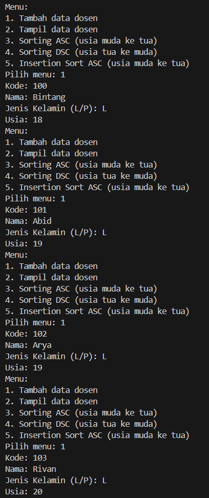

**Menampilkan Data**
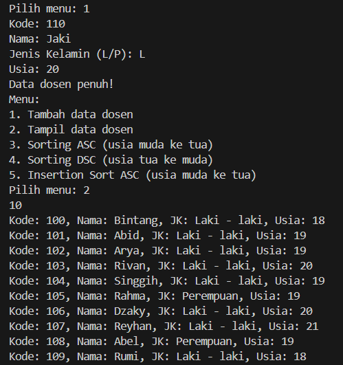

**Sorting ASC**
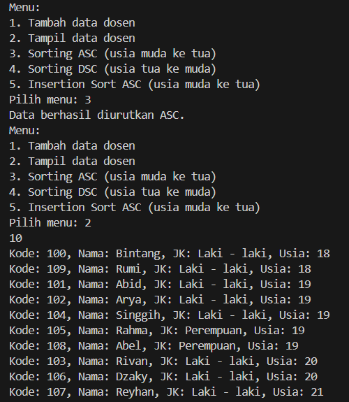

**Sorting DSC**
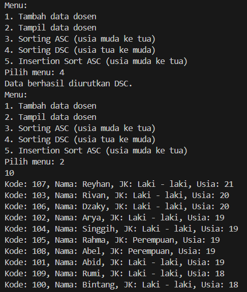

**Insertion Sort**
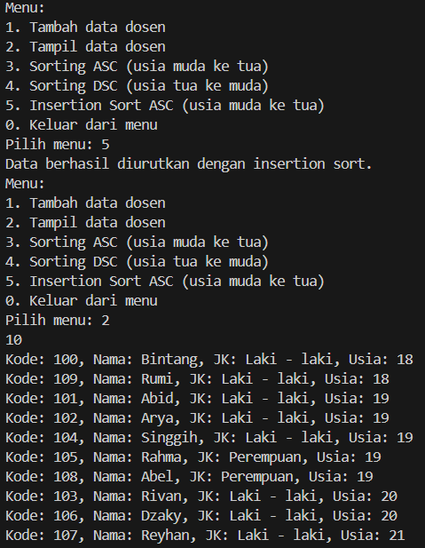

**Keluar Menu**
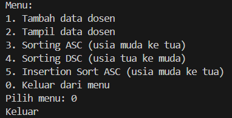