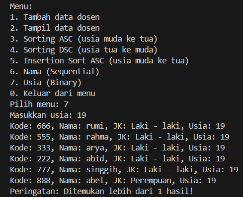

|  | Algoritma dan Struktur Data |
|--|--|
| NIM |  244107020115|
| Nama |  Bintang Pancahaya Prasetyo |
| Kelas | TI - 1H |
| Repository | [link] (https://github.com/BintangPancahaya/AlgoritmaStrukturData/tree/main/Jobsheet7) |

# JOBSHEET 7

## 6.2 Searching / Pencarian Menggunakan Agoritma Sequential Search

Hasil Kode Program


### Pertanyaan dan Jawaban

### 6.2.3 Pertanyaan

1. **Jelaskan perbedaan method `tampilDataSearch` dan `tampilPosisi` pada class MahasiswaBerprestasi05!**

    - **Jawaban**
     - Method `tampilDataSearch` akan menampilkan data lengkap mahasiswa (NIM, Nama, Kelas, IPK) berdasarkan ipk yang di cari.
     - Method `tampilPosisi` akan menampilkan posisi indeks dari data mahasiswa yang ditemukan berdasarkan IPK.

2. **Jelaskan fungsi break pada kode program dibawah ini!**
    ```java
    if (listMhs[j].ipk == cari) {
        posisi = j;
        break;
    }
    ```
    - **Jawaban**
     - Program sedang mencari data mahasiswa berdasarkan nilai ipk menggunakan perulangan (loop). Jika ditemukan ipk yang sama dengan nilai yang dicari (cari), maka nilai indeks j disimpan ke dalam variabel posisi. `break;` akan menghentikan proses pencarian lebih lanjut. Tujuannya
     agar program tidak melanjutkan pencarian ke elemen selanjutnya setelah data ditemukan.

## 6.3 Searching / Pencarian Menggunakan Binary Search

Hasil Kode Program


### 6.3.3 Pertanyaan

1. **Tunjukkan pada kode program yang mana proses divide dijalankan!**

    - **Jawaban**
     - ```java
        int mid = (left + right)/2;
        ```

2. **Tunjukkan pada kode program yang mana proses conquer dijalankan!**

    - **Jawaban**
     - ```java
        if (listMhs[mid].ipk == cari) {
        return mid;
        } else if (listMhs[mid].ipk < cari) {
        left = mid + 1;
        } else {
        right = mid - 1;
        }       
        ```

3. **Jika data IPK yang dimasukkan tidak urut. Apakah program masih dapat berjalan? Mengapa demikian!**

    - **Jawaban**
     - Program masih berjalan, tapi hasil dari binary search tidak akan benar.

4. **Jika IPK yang dimasukkan dari IPK terbesar ke terkecil (misal : 3.8, 3.7, 3.5, 3.4, 3.2) dan elemen yang dicari adalah 3.2. Bagaimana hasil dari binary search? Apakah sesuai? Jika tidak sesuai maka ubahlah kode program binary seach agar hasilnya sesuai**

    - **Jawaban**
     - Hasilnya akan tidak sesuai. Berikut modifikasi kode program agar hasilnya sesuai.
     ```java
     int binarySearchDescending(double cari) {
    bubbleSortDescending();
    int left = 0;
    int right = idx - 1;
    while (left <= right) {
        int mid = (left + right) / 2;
        if (listMhs[mid].ipk == cari) {
            return mid;
        } else if (listMhs[mid].ipk > cari) {
            left = mid + 1;
        } else {
            right = mid - 1;
        }
    }
    return -1;
    }
    ```
5. **Modifikasilah program diatas yang mana jumlah mahasiswa yang di inputkan sesuai dengan masukan dari keyboard.**

    - **Jawaban**
    
    

## **Langkah - langkah kode program saya**

### 1. Program `TugasDosen05.java`

**Method**
- `getNama()` : untuk mengambil nama.
- `getUsia()` : untuk mengambil usia.

### 2. Program `TugasDataDosen05.java`

**Method**
- `PencarianDataSequential(String nama)` : 
    - Cari dosen berdasarkan nama.
    - Pakai metode Sequential Search` (dari depan ke belakang).
    - Tampilkan semua yang cocok.
    - Diberi warning jika lebih dari satu nama yang sama.
- `PencarianDataBinary(int usia)`
    - Cari dosen berdasarkan usia.
    - Tapi karena pakai Binary Search, datanya harus diurutkan dulu berdasarkan usia (pakai selection sort).
    - Jika ketemu usia yang dicari, tampilkan semua yang cocok (cek kiri-kanannya juga).
- `sortingUsia()` : Sorting array listDosen berdasarkan usia pakai Selection Sort.

### 3. Program `TugasDosenDemo05.java`

**Fungsi Case**
- Case 6 - Mencari data berdasarkan nama (Sequential): Menggunakan method `dosen.PencarianDataSequential(name)`.
- Case 7 - Mencari data berdasarkan usia (Binary): Menggunakan method `dosen.PencarianDataBinary(age)`.

**Hasil Kode Program**



