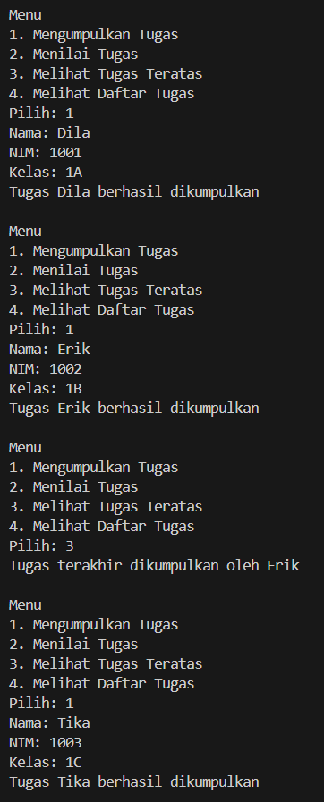
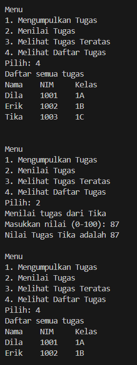
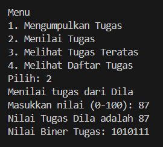
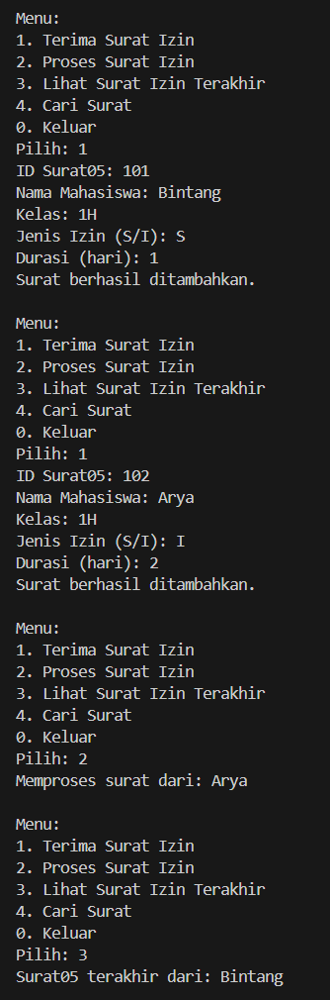
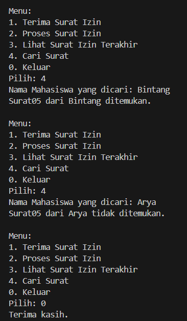

|  | Algoritma dan Struktur Data |
|--|--|
| NIM |  244107020115|
| Nama |  Bintang Pancahaya Prasetyo |
| Kelas | TI - 1H |
| Repository | [link] (https://github.com/BintangPancahaya/AlgoritmaStrukturData/tree/main/Jobsheet9) |

# JOBSHEET 9

## Percobaan 1 : Mahasiswa Mengumpulkan Tugas

Hasil Kode Program




### Pertanyaan dan Jawaban

### 2.1.3 Pertanyaan

1. **Lakukan perbaikan pada kode program, sehingga keluaran yang dihasilkan sama dengan verifikasi hasil percobaan! Bagian mana yang perlu diperbaiki?**

    - **Jawaban**
     ```java
     for(int i = top; i >= 0; i--){
            System.out.println(stack[i].nama + "\t" + stack[i].nim + "\t" + stack[i].kelas);
        } // <== Kode Perbaikan
    ```

2. **Berapa banyak data tugas mahasiswa yang dapat ditampung di dalam Stack? Tunjukkan potongan kode programnya!**
    
    - **Jawaban**
     ```java
    StackTugasMahasiswa stack = new StackTugasMahasiswa(5);
    ```
3. **Mengapa perlu pengecekan kondisi !isFull() pada method push? Kalau kondisi if-else tersebut dihapus, apa dampaknya?**

    - **Jawaban**
     - Pengecekan !isFull() mencegah penambahan elemen ke dalam stack jika stack sudah penuh. Jika if-else dihapus Akan terjadi ArrayIndexOutOfBoundsException saat mencoba menambahkan elemen ke array yang sudah penuh dan Program bisa crash/error saat runtime.

4. **Modifikasi kode program pada class MahasiswaDemo dan StackTugasMahasiswa sehingga pengguna juga dapat melihat mahasiswa yang pertama kali mengumpulkan tugas melalui operasi lihat tugas terbawah!**

    - **Jawaban**
      ```java
        public Mahasiswa bottom() {
        if (!isEmpty()) {
        return stack[0];
        } else {
        return null;
        }
        }
        ```
        Lalu menambahkannya di class Mahasiswa05Demo untuk memanggilnya
        ```java
        case 5:
                Mahasiswa05 bawah = stack.bottom();
                if (bawah != null) {
                    System.out.println("Tugas terbawah:");
                    System.out.println(bawah.nama + " - " + bawah.nim);
                } else {
                    System.out.println("Stack masih kosong!");
                }
                break;
        ```
5. **Tambahkan method untuk dapat menghitung berapa banyak tugas yang sudah dikumpulkan saat ini, serta tambahkan operasi menunya!**

    - **Jawaban**
     ```java
     public int jumlahTugas() {
    return top + 1;
    }
    ```
    Lalu di class Demonya
    ```java
    case 6:
    System.out.println("Jumlah tugas yang sudah dikumpulkan: " + stack.jumlahTugas());
    break;
    ```

## Percobaan 2 : Konversi Nilai Tugas ke Biner

Hasil Kode Program



### 2.2.3 Pertanyaan

1. **Jelaskan alur kerja dari method konversiDesimalKeBiner!**

    - **Jawaban**
     ```java
          while(nilai > 0){
        int sisa = nilai % 2;    // 2
        stack.push(sisa);        // 3
        nilai = nilai / 2;       // 4
        }
     ```
    Selama nilai masih lebih dari 0, lakukan:

     - Hitung sisa pembagian nilai dengan 2 (nilai % 2).

     - Simpan sisa ke dalam stack.

     - Bagi nilai dengan 2 (pembagian bilangan bulat).

    ```java
        String biner = new String();
        while(!stack.isEmpty()){
            biner += stack.pop();      // 5
        }
    ```
     - Buat string kosong untuk hasil biner.

     - Ambil isi stack satu per satu menggunakan pop():

     - Karena stack bersifat LIFO (Last In First Out), digit yang terakhir masuk (yang paling kecil) akan dikeluarkan paling akhir, sehingga urutannya menjadi benar.

2. **Pada method konversiDesimalKeBiner, ubah kondisi perulangan menjadi while (kode != 0), bagaimana hasilnya? Jelaskan alasannya!**

    - **Jawaban**
     - Hasil konversi tetap sama. Tidak akan ada perbedaan dalam hasil akhir selama nilai adalah bilangan positif (lebih dari nol). Tetapi jika nilai bisa bernilai negatif, maka nilai > 0 akan langsung berhenti (tidak jalan sama sekali). Sedangkan nilai != 0 akan masuk ke loop meski nilainya negatif, dan ini bisa menimbulkan loop tak berujung karena nilai / 2 dari bilangan negatif tidak akan pernah menjadi nol.

## **Langkah - langkah kode program saya**

### **1. Program `Surat05.java`**

**Deskripsi**:  
Mewakili data surat izin mahasiswa, berisi informasi identitas dan keperluan izin.

**Property**:
- `idSurat` : ID unik surat izin.
- `namaMahasiswa` : Nama mahasiswa yang mengajukan izin.
- `kelas` : Kelas mahasiswa.
- `jenisIzin` : Jenis izin ('S' = sakit, 'I' = izin).
- `durasi` : Lama izin dalam hari.

**Constructor**:
- `Surat05()` : Constructor kosong.
- `Surat05(String idSurat, String namaMahasiswa, String kelas, char jenisIzin, int durasi)` : Constructor dengan parameter lengkap untuk inisialisasi data surat.

### **2. Program `StackSurat05.java`**

**Deskripsi**:  
Mewakili struktur data **stack** untuk mengelola surat izin mahasiswa.

**Method**:

- `boolean isFull()`  
  Mengecek apakah stack penuh.

- `boolean isEmpty()`  
  Mengecek apakah stack kosong.

- `void push(Surat05 s)`  
  Menambahkan surat ke stack (top of stack). Jika penuh, tampilkan peringatan.

- `Surat05 pop()`  
  Menghapus dan mengembalikan surat paling atas. Jika kosong, tampilkan peringatan.

- `Surat05 peek()`  
  Melihat surat paling atas tanpa menghapusnya.

- `boolean cariSurat(String nama)`  
  Mencari apakah ada surat dari mahasiswa tertentu menggunakan **sequential search**.  
  Mengembalikan `true` jika ditemukan, `false` jika tidak.

### **3. Program `Surat05Demo.java`**

**Deskripsi**:  
Menjalankan simulasi interaktif untuk mengelola surat izin mahasiswa menggunakan stack.

**Fungsi Menu**:

- **Case 1 - Terima Surat Izin**  
  - Meminta input data surat dari pengguna.
  - Menambahkan surat ke stack menggunakan method `push()`.

- **Case 2 - Proses Surat Izin**  
  - Mengambil dan menghapus surat paling atas dari stack menggunakan `pop()`.
  - Menampilkan nama mahasiswa yang suratnya diproses.

- **Case 3 - Lihat Surat Terakhir**  
  - Melihat surat yang terakhir masuk (top of stack) dengan `peek()`.

- **Case 4 - Cari Surat**  
  - Meminta input nama mahasiswa.
  - Menggunakan `cariSurat(nama)` untuk mencari apakah surat dari mahasiswa tersebut ada di dalam stack.

- **Case 0 - Keluar**  
  - Mengakhiri program.

**Hasil Kode Program**




